# Implicit filtering of GLORYS12v1 (NEMO ORCA12 C-grid): Amazon plume / NBC region, January 1993

*Filtered fields:* `implicit_run/output/<CFG>/{U,V,W}_1993-01c_<CFG>.nc`. *Code:* `implicit_run/` (see §8). *Interactive walkthrough:* `implicit_data/v0.Implicit_filtering_ARP.ipynb`.

## Executive summary
**Data.** GLORYS12v1 daily U, V, W for January 1993 (31 days × 50 levels) on the regional ORCA12 cut (95°W–10°E, 10°S–30°N). They were implicitly filtered on the native C-grid with five scale configurations:
- windows of 1.5°, 2.0° and 2.5° (box-equivalent 167, 222 and 278 km at the equator)
- 2·L_d and 3·L_d, with L_d the first-baroclinic Rossby radius

Everything ran on one A100 GPU per configuration: 20–40 min for U,V plus ~14 min for W.

**Final product ("v3")**
- **U,V:** filtered jointly with the C-grid vector Laplacian in div–rot form, (1 + ½·M_ℓ)ū = u.
  - Zero normal flow and free slip at coasts.
  - For constant ℓ in open ocean it equals the component-wise scalar filter; the spherical metric terms are < 0.1 %, as in the vector addendum.
  - The filtered divergence is exactly the scalar-filtered original divergence at every level.
- **W:** the rigid-lid W product (`W_1993-01fc.nc`), filtered as a scalar at the same ℓ with the T-cell operator implied by the U,V filter. It is not recomputed from divergence (W correction). No barotropic correction is applied.
- **Continuity residual** R = ∂w̄/∂z + ∇h·ū:
  - Open ocean: the same as the unfiltered rigid-lid data, 3–9×10⁻¹¹ s⁻¹ at 110 m for the window configs, against a filtered divergence of ~3×10⁻⁷.
  - It is larger only at bottom steps and slopes next to coasts (~8×10⁻⁷ within 3 cells of land at 110 m) and near the western (95°W) and southern (10°S) cuts of the regional grid. Both cuts lie outside the analysis domain.
  - At the Amazon mouth, the surface-layer R is a smooth plume: the filtered river/free-surface source.

**How we got there.** Two approaches were run and rejected, and two bugs were found along the way.
- **Component-wise filtering of U and V (v1), as the task sheet specified.** Each component's no-flux walls produced a one-cell convergence line along every coast, and W recomputed from divergence reached ~10⁻³ m/s.
- **v2** (vector filter + barotropic correction + W from divergence) was superseded by the W correction.
- **Bug 1:** a missing e3 weight in the vorticity term (first v3 build).
- **Bug 2:** an operator mismatch between the U,V and W filters (first W run).

All are documented in §2 and were fixed and rerun.

**Parameter convention.** The `implicit_filter` package's `compute(n, k, data)` solves (1 + 2(−Δ)/k²). The γ = ½ filter at scale ℓ therefore needs **k = 2/ℓ, not 1/ℓ**.

**Recommendation.** **W2.0** (ℓ = 2°·R·cosφ/3.5 ≈ 63 km, box scale ≈ 222 km) for the full-dataset processing:
- removes 64–66 % of intra-monthly EKE
- keeps the NBC transport within −16 % (44°W) and −15 % (5°N)
- keeps the retroflection/NECC mean pattern (r = 0.99) and the >10° circulation (1.5 % RMS difference at the surface)

The Rossby-radius filters are unsuitable here: they are strongest exactly where the NBC is (equator, L_d ≈ 240 km) and weakest where the eddy field is (north of 15°N). See §7 for details and caveats: no filter at these scales removes NBC rings (300–450 km) without also degrading the NBC.

## 1. Mathematical summary

### 1.1 Filter equation, transfer function and box-filter equivalence
The coarse-grained field solves the low-pass implicit filter of Danilov et al. (2023) and Nowak et al. (2025) with γ = ½ and n = 1:

$$\left(1 + \gamma\,\mathcal{L}_\ell\right)\overline{\phi} = \phi, \qquad G(K) = \frac{1}{1 + \tfrac12 \ell^2 K^2}, \qquad \lambda = 2\pi\ell,$$

where $\mathcal{L}_\ell$ is a (negative) Laplacian scaled by ℓ², and $k_\ell = 1/\ell$ is the filter wavenumber.

**Box-filter factor 3.5.** A box filter of width $L$ has transfer $\operatorname{sinc}(KL/2)\approx 1-K^2L^2/24$. Matching the second moment to $G\approx1-\tfrac12\ell^2K^2$ gives $\ell = L/\sqrt{12} = L/3.46$. This is Nowak et al.'s $\ell_{box}/\ell\approx 3.5$ for γ = ½.

**Package parameter convention (checked in the source).** `implicit_filter` solves $(I + 2(-L/k^2))\phi$, i.e. γ = 2 with $k$. To obtain the γ = ½ filter at scale ℓ, the argument must be **k = 2/ℓ**. The task sheet's suggestion `k = 1/ℓ` would silently double ℓ. All code here uses γ and ℓ explicitly.

### 1.2 Velocity: vector (div–rot) form on the C-grid
**Why U,V are coupled.** Following the vector addendum, the spherical metric cross-terms of the vector Laplacian scale as $\ell^2\sin\varphi/(R^2\cos^2\varphi)$. That is 0 at the equator, ~0.01 % at 10°N, ~0.04 % at 20°N and ~0.07 % at 30°N, so they are negligible and none are included. Nevertheless, U and V are **not** filtered as independent scalars in the final product, for a different, discrete reason:
- A first production run (v1) filtered U on the U-grid and V on the V-grid, each with its own no-flux (Neumann) walls.
- That smooths each component toward offshore values right at the coast, while the flow through the land face stays zero.
- The result is a one-cell convergence line along **every** coastline and bottom step at **every** level: RMS divergence within 3 cells of land is 1.4–1.7× the original, while offshore it falls to 0.14–0.25×.
- Integrated vertically this gave $|w|\sim10^{-3}$ m/s (§3, continuity residual; §5).

The final filter (v3) therefore uses the C-grid vector Laplacian in div–rot form. For constant ℓ in open water it is identical to the component-wise Laplacian (metric terms dropped, as the addendum justifies):

$$\mathcal{L}_\ell\mathbf u = -\nabla\!\left(\ell_T^2\,\nabla\!\cdot\mathbf u\right) + \nabla\times\!\left(\ell_F^2\,\zeta\right),\qquad
\nabla\!\cdot\mathbf u = \frac{\delta_i(e_{2u}e_{3u}u)+\delta_j(e_{1v}e_{3v}v)}{e_{1t}e_{2t}e_{3t}},\quad
\zeta = \frac{\delta_i(e_{2v}v)-\delta_j(e_{1u}u)}{e_{1f}e_{2f}} .$$

This is NEMO's discrete divergence (T points, partial steps) and vorticity (F points). The discrete system is symmetric positive definite:

$$\Big(W + \gamma\big[F^{T}\Lambda_T F + C^{T}\Lambda_F C\big]\Big)\overline{\mathbf u} = W\mathbf u,$$

- $W=\mathrm{diag}(e_{1u}e_{2u}e_{3u},\,e_{1v}e_{2v}e_{3v})$
- $F$ is the T-cell flux-difference matrix, with $\Lambda_T=\ell_T^2/(e_{1t}e_{2t}e_{3t})$
- $C$ is the F-point circulation matrix, with $\Lambda_F=\ell_F^2 e_{3f}/(e_{1f}e_{2f})$ and $e_{3f}$ the minimum of the surrounding $e_{3u},e_{3v}$

**Boundary conditions.** Zero normal flow through land faces (they are not unknowns). Free slip: ζ = 0 at F points touching land. The open edges of the regional grid behave as walls.

**Exact discrete property.** $F W^{-1} C^T = 0$ (div curl = 0), therefore at every level

$$\nabla\!\cdot\overline{\mathbf u} = \left(1+\gamma(-\Delta_T\,\ell_T^2)\right)^{-1}\nabla\!\cdot\mathbf u ,$$

i.e. the filtered divergence is the no-flux scalar filter of the original divergence. There is no wall artefact. This was verified to a relative residual of 5×10⁻⁵.

**Scales.** With variable ℓ, $\ell_T$ is used at T points and $\ell_F$ at F points. The operator conserves the volume-weighted integral of each component.

### 1.3 W: scalar filter at the same scale (correction to Section 1.4 of the task sheet)
Following the W correction, W is **not** recomputed from the divergence. It is the rigid-lid W of `data/Fix_W.ipynb` (`data/variables_c/UVW/W_1993-01fc.nc`), filtered level by level as a scalar on the W/T points with the same $\ell_T$. There is no metric coupling between W and (U,V), so this is the exact vector-Laplacian treatment of W.

To make $\partial_z\overline w$ and $\nabla_h\cdot\overline{\mathbf u}$ pass through *the same* discrete operator, W at the top of T-cell k is filtered with exactly the T-cell operator implied by the level-k vector filter (`cgrid_filter.filter_level_w`):

$$\mathrm{vol}\,\overline w + \gamma\,F W^{-1}F^{T}\left(\ell_T^2\,\overline w\right) = \mathrm{vol}\,w, \qquad \mathrm{vol}=e_{1t}e_{2t}e_{3t},$$

- no-flux at land, with the same $e_3$ weights, the same placement of ℓ² and the same regional-edge treatment as the U,V filter
- solved in the symmetric variable $y=\ell_T^2\overline w$
- only cells above the sea floor (tmask) are filtered; the surface value 0 (rigid lid) and the sea-floor value 0 are kept
- no barotropic correction

**Why this operator.** A first W run used the plain scalar Laplacian $\nabla\cdot(\ell^2\nabla)$. It left an avoidable open-ocean residual where ℓ varies, 1–2×10⁻⁸ s⁻¹ in the Rossby configs. With the consistent operator, the open-ocean residual equals the original, a few ×10⁻¹¹ s⁻¹.

**Validation quantity.** The continuity residual on T cells:

$$R = \partial_z\overline w + \nabla_h\cdot\overline{\mathbf u}_h = \frac{\overline w_k - \overline w_{k+1}}{e_{3t,k}} + \nabla_h\cdot\overline{\mathbf u}_{h,k}.$$

Where levels k and k+1 share the same wet mask, R is the filter applied to the original residual, which is small. There are two exceptions:
1. **Bottom steps**, where the mask of level k+1 differs from level k. There $\overline w_{k+1}$ is filtered on a different domain; this is inherent to level-by-level filtering.
2. **Near the open edges of the regional cut.** There the discrete "divergence" of the edge cells misses the flow through the cut, and the filter spreads that deficit inward over ~2 box widths.

Near the Amazon mouth R also carries the filtered surface source.

### 1.4 Scales used
| Config | Definition | ℓ range in domain | ℓ at 0° / 10°N / 20°N / 30°N | box scale $3.5\ell$ at 0° |
|---|---|---|---|---|
| W1.5 | $\ell = 1.5°\cdot\frac{\pi}{180}R\cos\varphi/3.5$ | 41–48 km | 47.6 / 46.9 / 44.8 / 41.3 km | 167 km |
| W2.0 | same, 2.0° | 55–64 km | 63.5 / 62.5 / 59.7 / 55.0 km | 222 km |
| W2.5 | same, 2.5° | 69–79 km | 79.4 / 78.2 / 74.6 / 68.8 km | 278 km |
| R2Ld | $\ell = 2L_d/3.5$, Gaussian-smoothed (σ = 6 cells) | see diag | ≈135 / 61 / 30 / 19 km | ≈474 km |
| R3Ld | $\ell = 3L_d/3.5$ | see diag | ≈203 / 91 / 45 / 28 km | ≈711 km |

R = 6371 km and φ is the local latitude; the Rossby values are Atlantic zonal medians.

**Rossby radius.** $L_d$ is the WKB first-baroclinic radius from the GLORYS January-1993 mean T/S: $c_1=\frac1\pi\int N\,dz$, $L_d=\min(c_1/|f|,\sqrt{c_1/2\beta})$ (Chelton et al. 1998).
- On the shelf (H < 1000 m) and over land, $c_1$ is extrapolated from deep water.
- Atlantic zonal medians: 237 km (0°), 196 km (5°N), 106 km (10°N), 52 km (20°N), 33 km (30°N).
- The discrete eigenproblem gives values ~4–5 % below WKB.
- The Chelton file could not be downloaded, so no comparison was made.
- At 10°N, $L_d$ is larger than the task sheet's 50–80 km because $c_1\approx2.7$ m/s and $f=2.5\times10^{-5}$ s⁻¹. This matches Chelton et al. for the deep tropical Atlantic.

## 2. Computational summary
**Environment.** `/work/bk1450/b383184/conda/envs/implicit_filter`, built by `build_env.sh`:
- Python 3.11, CuPy 14.2 with the CUDA 12.4 runtime and headers from conda-forge (NVIDIA driver 580 / CUDA 13)
- SciPy, xarray, netCDF4, JAX, papermill
- `implicit_filter` 1.3.1 installed editable from `../implicit_filter`
- Jupyter kernel `implicit_filter`

**Hardware.** DKRZ Levante GPU partition, one NVIDIA A100-80GB per configuration (account `bk1450_gpu`). The five configurations run as parallel jobs.

**Solver.** Batched Jacobi-preconditioned CG in CuPy, solving all 31 days of a level simultaneously, relative tolerance 10⁻⁸, float64.
- U,V: 847,626 coupled unknowns at the surface.
- W: 417,000 unknowns at the surface.
- The operators are rebuilt per level from the NaN mask of the data, in vectorised NumPy on the CPU, in about 1 s.

| Config | CG its U,V | CG its W | GPU time U,V per level (31 days) | per field per day | W per level | wall-clock (U,V+W run / final W rerun) |
|---|---|---|---|---|---|---|
| W1.5 | 110–114 | 94–99 | 5.1 s | 82 ms (U+V) | 3.1 s | 20.8 + 13.3 min |
| W2.0 | 150–154 | 126–133 | 6.6 s | 106 ms | 3.7 s | 22.4 + 13.3 min |
| W2.5 | 188–195 | 157–167 | 8.1 s | 131 ms | 4.3 s | 24.0 + 13.3 min |
| R2Ld | 288–329 | 249–294 | 13.3 s | 215 ms | 6.7 s | 30.4 + 13.7 min |
| R3Ld | 443–504 | 373–433 | 19.7 s | 318 ms | 9.3 s | 38.8 + 15.6 min |

**Where the wall-clock time goes.** GPU solves take 6–23 min per job. Compressed NetCDF writing takes ~9 min. The continuity-residual diagnostics, computed for original and filtered fields on CPU, take ~5 min. Output is ~5.6 GB per configuration.

**Issues encountered and how they were resolved**
1. **CUDA libraries.** CuPy from conda-forge initially lacked the CUDA runtime and the headers for JIT kernels. Fixed by adding `cuda-cudart(-dev)`, `libcusparse(-dev)`, `libcublas(-dev)`, `cuda-nvrtc(-dev)` and `cuda-cccl`, and setting `CUDA_PATH=$ENV/targets/x86_64-linux`.
2. **`implicit_filter` package bugs.** The GPU backend fails with CuPy ≥ 14 (`tol` was renamed `rtol`). `k` must be a Python `float`. `NemoFilter` builds only a T-grid operator, with index errors in its metric arrays. With variable scales its column scaling is not symmetric. The package was used only for a cross-check: its solver reproduces this operator to 2×10⁻⁸ for constant ℓ.
3. **Component-wise U,V filtering (v1)** created wall-divergence artefacts (section 1.2). This was replaced by the vector div–rot operator.
4. **W from continuity (v1, v2)** contained no river or free-surface source and was replaced by the scalar W filter (W correction). The intermediate barotropic correction (v2) was dropped.
5. **Missing e3 weight in the first v3 build.** The vorticity term lacked $e_{3f}$, so below ~20 m U,V were barely filtered. An analysis agent caught this, and it was fixed and rerun. The regression test `tests/test_e3_independence.py` checks shear and divergent waves at e3 = 1, 50 and 200 m.
6. **Empty depth axis in W files.** `netCDF4.renameVariable` on the depth coordinate silently wrote fill values; the v1/v2 W files have an empty `depthw`. Fixed by creating the coordinate directly.
7. **No umask/vmask in the mesh files.** Wet masks come from the data NaNs. They equal $t_{mask}(i)\,t_{mask}(i{+}1)$ except in the last column (U) and last row (V) of the regional cut.
8. **W operator inconsistent with the U,V filter (first W run).** It was flagged by the divergence analysis. The plain scalar Laplacian ∇·(ℓ²∇) differs from the T-cell operator implied by the vector filter, ∇·∇(ℓ²·) with e3 weights. Where ℓ varies, this left an open-ocean continuity residual of 1–2×10⁻⁸ s⁻¹. W was refiltered with the consistent operator (`filter_level_w`, `run_filter.py --w-only`), bringing the open-ocean residual down to the original level.

## 3. Filter transfer functions, continuity residual and W

This section covers the final v3 filter, with the e3f-weighted vorticity fix applied. U and V are filtered together with the vector div–rot operator.
W is the rigid-lid GLORYS W (`W_1993-01fc.nc`) filtered as a scalar with the same ℓ_T, using the T-cell operator implied by the vector filter (`filter_level_w`). January 1993, all 5 configurations.

*Update:* the W, residual and W-statistics parts were recomputed after W was refiltered with the consistent operator. The U,V spectra are unchanged.

Scripts in `analysis/spectra_divergence/`:
- `spectra.py [hann|tukey] [UV|W]`: spectra and transfer functions.
- `theory_validation.py`: theoretical G(λ) by latitude and the synthetic test.
- `residual.py` and `residual_extra.py`: continuity residual.
- `w_stats.py`: W statistics.
- `make_metrics.py`: builds `metrics.json`.

The superseded v1 analysis (component-wise filter, W from divergence) is kept in `old_v1/`.

#### 1. Filter response

**Theory.** G(K) = 1/(1+½ℓ²K²). The power transfer G² equals ½ at λ½ = 6.90ℓ.
- The W configs barely depend on latitude: ℓ is 48/64/79 km at the equator and 41/55/69 km at 30°N.
- The Rossby configs vary by a factor of 7 over the domain. v3 uses Ld smoothed with σ = 6 cells. For R2Ld, ℓ is 136, 61, 30 and 19 km at 0°, 10°, 20° and 30°N (zonal-median Ld over 60–20°W: 237, 106, 52, 33 km).
- As a result, R3Ld filters much more strongly than W2.5 at the equator and more weakly poleward of about 12°N.

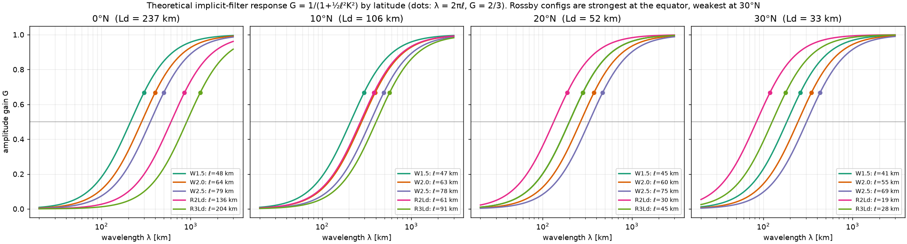

**Synthetic validation** (`tests/validate_filter.json`). Cosines on the real U-grid metrics, constant ℓ, no land. The maximum gain error against G is 0.008. A 1D box filter of the same ℓ_box has negative side lobes.

| ℓ_box (ℓ) | λ [km] | 50 | 100 | 200 | 400 | 800 |
|---|---|---|---|---|---|---|
| 167 km (47.7) | implicit zonal / merid | 0.056 / 0.058 | 0.181 / 0.186 | 0.464 / 0.473 | 0.775 / 0.781 | 0.932 / 0.934 |
| | theory G / 1D box | 0.053 / −0.084 | 0.182 / −0.164 | 0.471 / 0.189 | 0.781 / 0.737 | 0.934 / 0.930 |
| 222 km (63.4) | implicit zonal / merid | 0.033 / 0.034 | 0.111 / 0.115 | 0.328 / 0.337 | 0.661 / 0.669 | 0.886 / 0.890 |
| | theory G / 1D box | 0.031 / 0.070 | 0.112 / 0.091 | 0.335 / −0.097 | 0.668 / 0.565 | 0.890 / 0.878 |
| 278 km (79.4) | implicit zonal / merid | 0.021 / 0.022 | 0.074 / 0.076 | 0.238 / 0.244 | 0.554 / 0.563 | 0.832 / 0.837 |
| | theory G / 1D box | 0.020 / −0.056 | 0.074 / 0.073 | 0.243 / −0.215 | 0.562 / 0.375 | 0.837 / 0.813 |

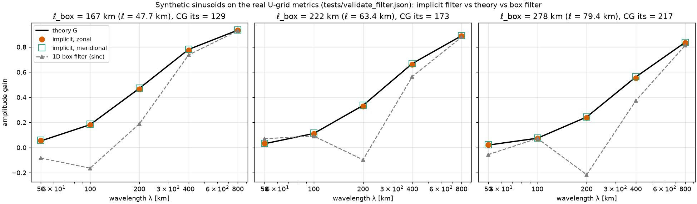

**Empirical spectra: method.**
- Three index-rectangle boxes, each checked to be wet including a one-cell halo at every level used:
  - WTA: 50–35°W, 5–14°N, 1652×995 km.
  - STA: 55–35°W, 18–28°N, 2052×1115 km.
  - EQA: 28–10°W, 4°S–4°N, 2009×898 km.
- The suggested boxes 55–35°W 2–14°N and 35–15°W 3°S–3°N contain land (the Brazilian shelf, and Fernando de Noronha at 100 m).
- Fields: U and V on native points at 0.5 m and 110 m; W at the W levels 100.6 m and 495.7 m.
- Processing: remove a least-squares plane, apply a 2D Hann window, FFT, and bin radially.
- Average the 31 daily spectra, then take T = E_filt/E_orig.
- Theory curves use the box-mean ℓ_T, exactly as in the filter.
- ℓ_eff is a least-squares fit of G²(ℓ_eff) to T over 60 km < λ < L_min/2.
- A Tukey(0.5) window changes ℓ_eff/ℓ by ≤0.05 (`metrics_spectra*_tukey.json`).

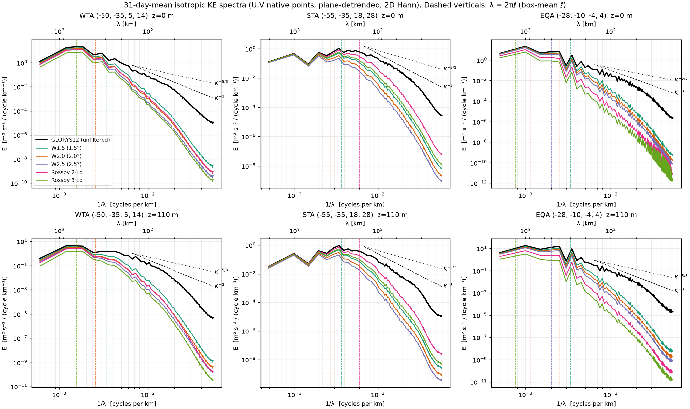
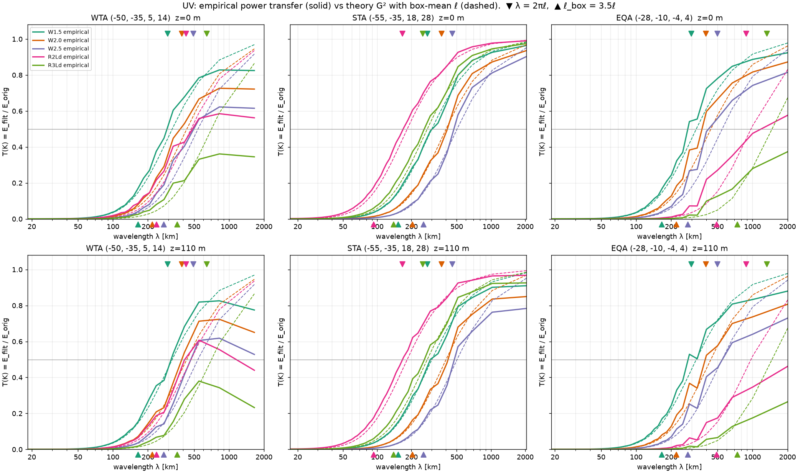
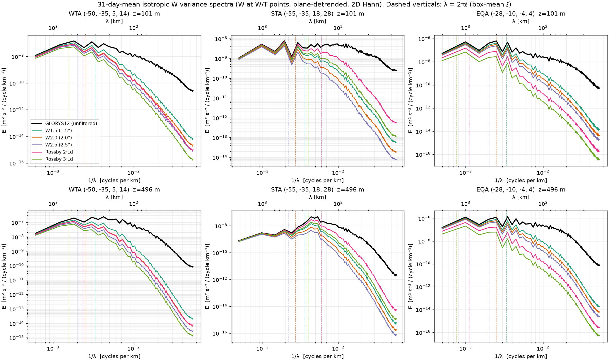
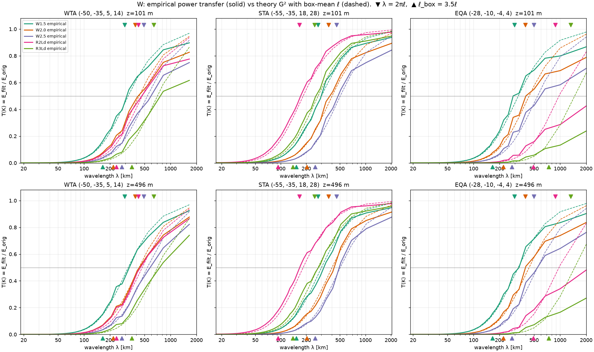

ℓ_eff/ℓ (Hann):

| box | field, z | W1.5 | W2.0 | W2.5 | R2Ld | R3Ld |
|---|---|---|---|---|---|---|
| STA | U,V 0.5 / 110 m | 0.99 / 0.99 | 0.99 / 0.99 | 0.98 / 0.99 | 0.93 / 0.92 | 0.93 / 0.93 |
| STA | W 100 / 496 m | 0.98 / 1.02 | 0.97 / 1.03 | 0.95 / 1.02 | 0.94 / 0.93 | 0.93 / 0.95 |
| WTA | U,V 0.5 / 110 m | 0.92 / 0.96 | 0.90 / 0.95 | 0.88 / 0.93 | 0.88 / 0.92 | 0.89* / 0.89* |
| WTA | W 100 / 496 m | 0.97 / 0.99 | 0.96 / 0.99 | 0.95 / 0.99 | 0.94 / 0.94 | 0.92* / 0.92* |
| EQA | U,V 0.5 / 110 m | 0.91 / 0.93 | 0.88 / 0.92 | 0.85 / 0.90 | 0.76* / 0.85* | 0.69* / 0.81* |
| EQA | W 100 / 496 m | 0.95 / 0.97 | 0.93 / 0.96 | 0.92 / 0.94 | 0.88* / 0.88* | 0.86* / 0.84* |

\* The box does not resolve λ½: theoretical λ½ exceeds half the short box side. In EQA, ℓ = 141/211 km for R2Ld/R3Ld.

Half-power wavelength, empirical / theory [km], at the surface: STA W2.0 414/403, WTA W2.0 380/432, EQA W2.0 368/438. At 100 m for W: STA 380/403, WTA 423/432, EQA 402/438.
In every case the retained variance fraction matches ∫E_orig G² / ∫E_orig within 0.02; the only exception is R2Ld/R3Ld in WTA (0.49 vs 0.55).

**Interpretation.**
- **Scalar W filter.** It has the same G(K) as the vector U,V filter. For the W configs, ℓ_eff/ℓ = 0.92–1.03, and it is closest to 1 at 500 m and in the subtropics.
- **Subtropics.** The U,V response matches theory essentially exactly (0.98–0.99). Only 16–35% of KE survives the W filters there, because the eddy energy sits at λ < 400 km.
- **Tropical boxes.** The weaker empirical response at the surface (0.85–0.92) is not explained by ℓ, which is constant to 1% in these boxes. The likely causes are Hann smearing of a very red, anisotropic equatorial spectrum over ~900–1000 km short sides, and, for WTA, the nearby Brazilian coast.
- **Rossby configs.** The 5–8% lower ℓ_eff in STA and WTA reflects the ℓ range inside the box (STA R2Ld: 18–38 km; WTA: 40–123 km), since G² is convex in ℓ.
- **v3 vs v1.** The vector filter keeps the scalar G(K) in open ocean: for the W configs, v1 and v3 give identical ℓ_eff/ℓ to ±0.01 for U,V.

#### 2. Continuity residual R = ∂w̄/∂z + ∇h·ū

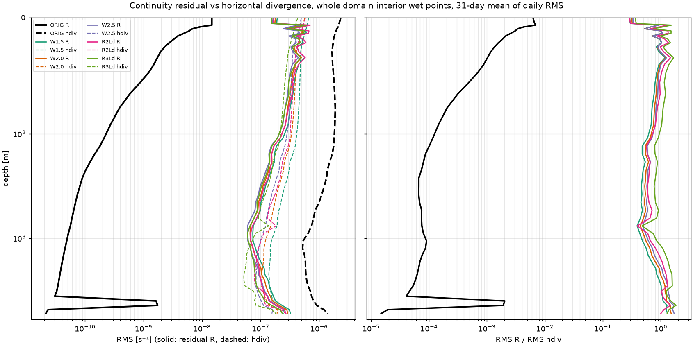

**What R means for ORIG.**
- The rigid-lid W is w_fix = w − (H−z)/H·w(0). The original GLORYS W satisfies bottom-up continuity with U,V to round-off: R computed with it has RMS 8×10⁻¹³ and max 6×10⁻¹¹ s⁻¹.
- Consequently R_orig = −w(0)/H, the depth-uniform spreading of the surface w that Fix_W removed. This holds to 1.5×10⁻⁴ relative RMS over all levels (day 1) and 5×10⁻³ at 110 m.
- R_orig is 1.5×10⁻⁸ s⁻¹ (whole-domain RMS) at the surface, 2×10⁻¹⁰ at 110 m and 6×10⁻¹¹ at 760 m. It is largest on shallow shelves, where H is small.

**Filtered, whole-domain RMS** (diag npz, rows/columns 0–1 and the last two excluded).

| RMS [s⁻¹] | surface: R / hdiv | 110 m: R / hdiv | 760 m: R / hdiv |
|---|---|---|---|
| ORIG | 1.5e-8 / 2.3e-6 | 2.1e-10 / 1.8e-6 | 5.6e-11 / 7.5e-7 |
| W1.5 | 1.9e-7 / 6.6e-7 | 2.4e-7 / 4.1e-7 | 7.6e-8 / 1.9e-7 |
| W2.0 | 1.8e-7 / 5.7e-7 | 2.2e-7 / 3.3e-7 | 6.8e-8 / 1.5e-7 |
| W2.5 | 1.7e-7 / 5.0e-7 | 1.9e-7 / 2.8e-7 | 6.0e-8 / 1.2e-7 |
| R2Ld | 1.7e-7 / 5.8e-7 | 2.1e-7 / 3.2e-7 | 7.0e-8 / 1.9e-7 |
| R3Ld | 1.6e-7 / 4.3e-7 | 1.9e-7 / 2.2e-7 | 6.5e-8 / 1.4e-7 |

Domain-wide, R reaches 30–86% of the filtered RMS hdiv. It is not uniformly small. The decomposition below shows that it comes almost entirely from edges, coasts and the ℓ gradient of the Rossby configs.

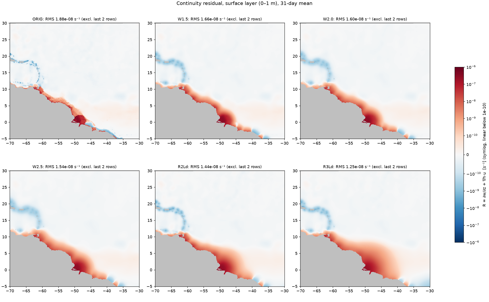
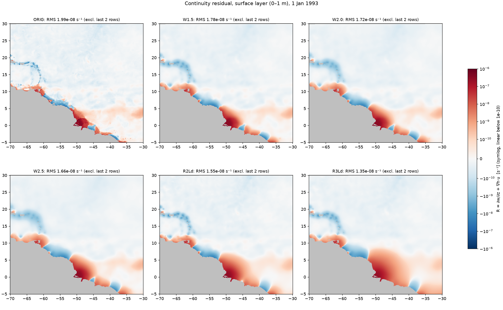

**Surface-layer maps, 70–30°W 5°S–30°N.** RMS excludes the last two grid rows (30°N). On day 1 it is 2.0×10⁻⁸ for ORIG and 1.7–2.1×10⁻⁸ for the configs.
- **ORIG:** R is concentrated on the North Brazil / Amazon shelf, including runoff-like blocky patches (see below), and is ~10⁻¹¹ offshore.
- **W configs:** R offshore is a smooth eddy-scale pattern of ±10⁻¹⁰–10⁻⁹. The shelf signal is smoothed into a plume around the mouth. A band of 10⁻⁸–10⁻⁷ lies along the northern edge (30°N).
- **Rossby configs:** R offshore is 10⁻⁸–10⁻⁷ in zonal bands at 0–12°N, where ℓ changes fastest (see below).

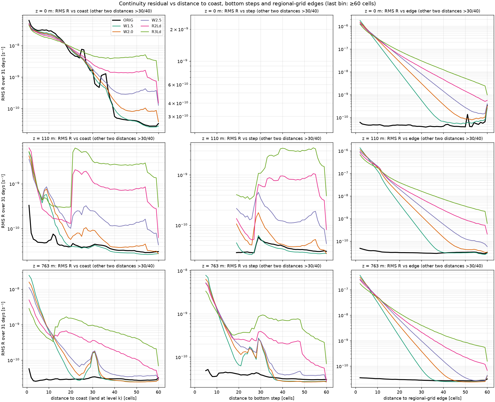

**Decomposition over the full month** (all 31 days, all configs; distances in grid cells; `metrics_residual.json`). The categories are:
- **clean:** >40 cells from an edge, >30 from the coast and >30 from a bottom step;
- **edge ≤20:** within 20 cells of an edge, >30 from the coast;
- **coast ≤3:** within 3 cells of the coast.

| RMS R [s⁻¹] | level | ORIG | W1.5 | W2.0 | W2.5 | R2Ld | R3Ld |
|---|---|---|---|---|---|---|---|
| clean | 0.5 m | 3.3e-10 | 2.4e-10 | 3.0e-10 | 4.2e-10 | 8.9e-10 | 2.4e-9 |
| clean | 110 m | 3.2e-11 | 2.9e-11 | 3.7e-11 | 9.1e-11 | 4.4e-10 | 1.5e-9 |
| clean | 763 m | 3.1e-11 | 3.9e-11 | 4.0e-11 | 4.6e-11 | 1.2e-10 | 3.7e-10 |
| coast >30 incl. edges | 110 m | 3.3e-11 | 1.6e-7 | 1.5e-7 | 1.3e-7 | 1.1e-7 | 9.1e-8 |
| edge ≤20, coast >30 | 0.5 m | 4.7e-11 | 6.3e-7 | 5.9e-7 | 5.4e-7 | 5.5e-7 | 4.9e-7 |
| edge ≤20, coast >30 | 110 m | 3.7e-11 | 4.7e-7 | 4.3e-7 | 3.9e-7 | 3.3e-7 | 2.7e-7 |
| coast ≤3 | 0.5 m | 5.6e-8 | 1.5e-7 | 1.4e-7 | 1.4e-7 | 1.3e-7 | 1.4e-7 |
| coast ≤3 | 110 m | 9.5e-10 | 9.1e-7 | 8.1e-7 | 7.2e-7 | 9.0e-7 | 7.9e-7 |
| coast ≤3 | 763 m | 1.6e-10 | 2.8e-7 | 2.5e-7 | 2.2e-7 | 2.9e-7 | 2.7e-7 |

Share of domain ΣR² for the filtered fields:
- **Surface:** 96–100% from edge ≤20, 2–3% from coast ≤3.
- **110 m:** 42–51% from edge ≤20 and 57–70% from coast ≤3 (the two overlap where coasts meet an edge).
- **763 m:** 38–46% from edge ≤20 and 67–79% from coast ≤3.

**Confirming or refuting the coordinator's single-day test (W2.0, 110 m).** Both parts are confirmed over the full month.
- **Away from edges and land:** 1.1×10⁻¹⁰ (coordinator: 4×10⁻¹¹ for one day). ORIG has 3.2×10⁻¹¹ there, so the filtered fields are within a factor of ~3.5 of the rigid-lid ORIG.
- **Including cells near the edges:** 1.5×10⁻⁷ (coordinator: 7×10⁻⁸).
- **Coasts:** 7.9×10⁻⁷ within 3 cells.
- **Bottom steps:** in the open ocean at 763 m, R rises from 5×10⁻¹¹ to 3×10⁻⁹ within about 15 cells of a step, but only a few cells are both near a step and far from the coast. Most steps coincide with coasts and slopes at that level, so the coastal number carries most of the step effect.
- **By edge** (110 m, W2.0, within 20 cells, after the W update): western (95°W) 1.2×10⁻⁶, southern (10°S) 3.5×10⁻⁷, eastern 4.8×10⁻⁸, northern (30°N) 3×10⁻¹¹.
- **Decay from the edge:** R drops to the clean level at about 40 (W1.5), 50 (W2.0) and 60 cells (W2.5), i.e. about 2ℓ_box. For the Rossby configs it now reaches ≤1.5×10⁻⁹ (before the W update: ~5×10⁻⁹).
- **Recommendation:** treat W as inconsistent with U,V within ~50 cells (~450 km) of the western (95°W) and southern (10°S) edges of the regional grid. Both lie outside the 70–30°W, 5°S–30°N analysis domain. After the W update the 30°N edge shows no residual.

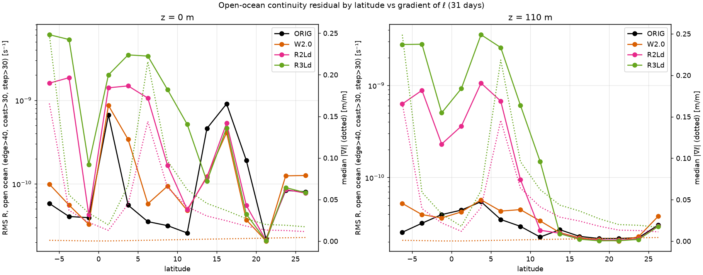

**Rossby configs: residual from the spatial variation of ℓ, now fixed.**
- In the first W run, the open-ocean R of R2Ld/R3Ld was 40–60× that of the W configs, 1–2×10⁻⁸ s⁻¹. It peaked at 5°N and 7.5°S, where |∇ℓ| peaks.
- The cause was the operator form: the vector filter smooths the divergence as D̄ − γ∇·∇(ℓ²D̄) = D, while the scalar W filter used W̄ − γ∇·(ℓ²∇W̄) = W.
- W is now filtered with exactly the T-cell operator of the vector filter (`filter_level_w`). Open-ocean ("clean") R dropped by 14–17× for R2Ld (6.2e-9 → 4.4e-10 at 110 m) and 4× for R3Ld. For the W configs it is now at the rigid-lid ORIG level (3–9×10⁻¹¹ at 110 m).
- The small remaining R3Ld value (1.5e-9 at 110 m) comes from the grid-scale e3 and ℓ variations of the smoothed Ld field. It is below 1 % of the filtered divergence.
- **Edges after the update** (110 m, W2.0, within 20 cells): 95°W 1.2×10⁻⁶, 10°S 3.5×10⁻⁷, 10°E 4.8×10⁻⁸ and **30°N 3×10⁻¹¹ (clean)**. The residual at the W and S edges comes from the regional cut: the edge cells' discrete divergence misses the flux through the cut. It is far outside the 70–30°W analysis domain.

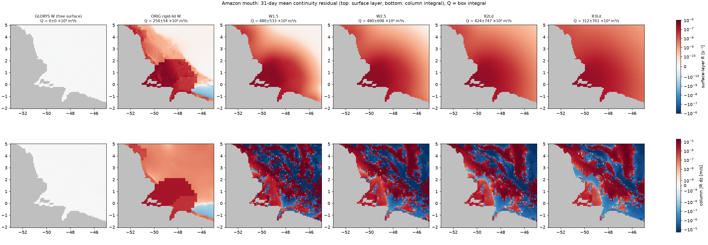

**Amazon mouth (53–45°W, 2°S–5°N).**
- **GLORYS's own free-surface W:** R ≈ 0, with RMS 4×10⁻¹³ s⁻¹ and box-integrated source Q = 0.07 m³/s. The original W is fully determined by U,V through bottom-up continuity. The river and E−P source is therefore *not* a residual in GLORYS. It is already inside W, as the non-zero surface value w(0) = −∫∇h·u dz, which includes the divergence of the river outflow.
- **Rigid-lid ORIG:** Fix_W removes w(0) linearly, so the source reappears in R as −w(0)/H, uniform over the column. The box- and depth-integrated source is Q = ∫R dV = 2.5×10⁵ ± 0.5×10⁵ m³/s (31-day mean ± daily std). This is the order of the Amazon + Pará discharge plus P−E over the box (Amazon mean ≈ 2×10⁵ m³/s), with daily ∂η/∂t on top.
- **The source appears as blocky, depth-uniform patches** of 10⁻⁷–5×10⁻⁷ s⁻¹ at the mouth. These most likely reflect GLORYS's runoff distribution. That the source is inside W (as w(0)) and not in R is established above; the attribution of the patches specifically to runoff is an interpretation.
- **Filtered surface layer:** R is a smooth plume, the filtered source. Its maximum is 2.6–3.2×10⁻⁷ s⁻¹ (ORIG 4.7×10⁻⁷) and its box RMS 0.8–1.0×10⁻⁷ (ORIG 1.1×10⁻⁷). So, following the user's instructions, R at the mouth can be read as the filtered river source *in the surface layer*.
- **But not as a volume budget.** The filtered box- and depth-integrated Q is 3.1–4.8×10⁵ m³/s with a daily std of 5–7×10⁵ m³/s, against ±0.5×10⁵ for ORIG. The column integral of R is dominated by ±10⁻⁵ m/s structures along the shelf break and slope at deeper levels, which are the coastal and step residual (table above). A reliable source estimate is only possible for ORIG.

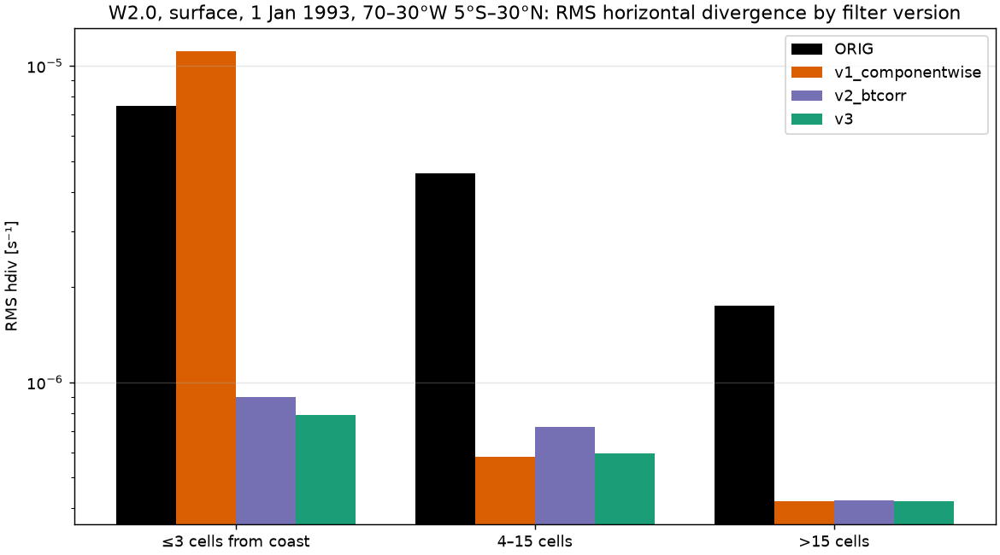

**v1 vs v2 vs v3: coastal divergence** (W2.0, surface, 1 Jan, 70–30°W 5°S–30°N). RMS hdiv [s⁻¹]:

| | ORIG | v1 component-wise | v2 vector + bt-corr | v3 vector |
|---|---|---|---|---|
| first wet cell | 6.8e-6 | **2.0e-5** | 7.6e-7 | 8.7e-7 |
| ≤3 cells from coast | 7.5e-6 | **1.1e-5** | 9.0e-7 | 7.9e-7 |
| 4–15 cells | 4.6e-6 | 5.8e-7 | 7.2e-7 | 5.9e-7 |
| >15 cells | 1.7e-6 | 4.2e-7 | 4.2e-7 | 4.2e-7 |

- v1's one-cell convergence line along walls (3× ORIG in the first wet cell) is gone in v2 and v3.
- In v3 the coastal divergence is smoothly reduced: the ≤3-cell band is 0.11× ORIG, while offshore stays at 0.24×.
- v3 and v2 agree offshore to within 1%. v3 has slightly lower divergence in the coastal band, though slightly higher in the first wet cell.

#### 3. W statistics

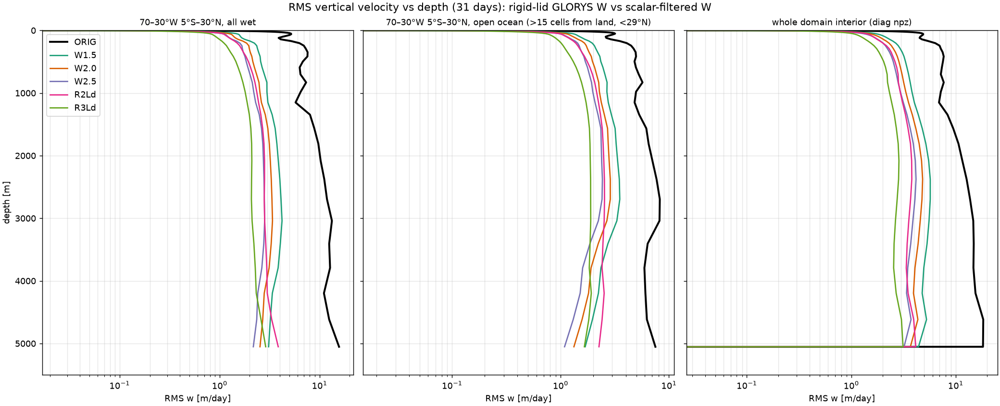

- **Sanity checks:** filtered W is exactly 0 at the surface and at every sea-floor W point, with no NaN in wet cells (day 1, all configs).
- **RMS W over 70–30°W 5°S–30°N, 31 days:**

| m/s (ratio to ORIG) | 100 m | 500 m | 1000 m |
|---|---|---|---|
| ORIG (rigid-lid) | 4.9e-5 | 7.9e-5 | 7.5e-5 |
| W1.5 | 1.9e-5 (0.38) | 3.0e-5 (0.38) | 3.4e-5 (0.46) |
| W2.0 | 1.6e-5 (0.33) | 2.5e-5 (0.32) | 2.9e-5 (0.39) |
| W2.5 | 1.4e-5 (0.28) | 2.1e-5 (0.27) | 2.5e-5 (0.34) |
| R2Ld | 1.4e-5 (0.28) | 2.2e-5 (0.28) | 2.7e-5 (0.36) |
| R3Ld | 1.1e-5 (0.21) | 1.7e-5 (0.21) | 2.1e-5 (0.28) |

- Open ocean only (>15 cells from land, <29°N): ORIG 3.0/5.6/5.8×10⁻⁵ m/s; W2.0 1.5/2.3/2.6×10⁻⁵ (ratios 0.50/0.41/0.46). The ratios are higher than for all wet points because ORIG W is enhanced near topography.
- The filtered W keeps 21–46% of the RMS, consistent with W variance being concentrated at small scales: the retained W variance in the spectral boxes is 4–50%. The v1 problem, with W at 10× ORIG, is gone.

#### Problems / caveats
1. **Regional-grid edges.**
   - The residual is 3–10×10⁻⁷ s⁻¹ within 20 cells of the western and southern edges, and still 10⁻⁸ within 20 cells of 30°N. It decays to background only about 2ℓ_box (35–55 cells) inside.
   - After the W update the 30°N edge (inside the analysis domain) is clean; the western and southern edges are outside it.
2. **Coasts and steep topography.**
   - The residual within 3 cells of land is 1–9×10⁻⁷ s⁻¹ at 0.5–760 m, 10³× ORIG at depth. It dominates the domain R² below the surface.
   - For Lagrangian tracking near the shelf break and slope, U,V and W are not mutually consistent at these levels.
3. **Rossby configs.** The open-ocean R from the different operator forms was fixed by filtering W with the vector filter's T-cell operator. Remaining clean-region R is ≤1.5×10⁻⁹ s⁻¹.
4. **Amazon.**
   - The filtered surface-layer R is a plausible filtered source.
   - The box- and depth-integrated filtered source is not usable: 3–5×10⁵ ± 5–7×10⁵ m³/s vs ORIG 2.5×10⁵ ± 0.5×10⁵.
   - In GLORYS itself the source lives in W (w(0)), not in R.
5. **Tropical spectra.** The U,V spectral response is 10–24% weaker than G² in λ½ at the surface (W: 0–16%). This is attributed to window, box size and the nearby coast. KE and W variance retention still match G² within 0.02.
6. **Run history.** An intermediate v3 run (vorticity term without e3f) was discarded. All numbers here are from the fixed rerun (output/V3_FIXED).

## 4. North Brazil Current before/after, energy and large-scale retention

**What was analysed**
- **Filter version:** v3 with the e3 fix. U and V are filtered jointly with the vector div–rot operator: zero normal flow at land, free slip, and ℓ_F² e3f/(e1f e2f) in the curl term. W is the rigid-lid product filtered as a scalar.
- **Data:** GLORYS12v1, January 1993, 31 daily fields. ORIG means unfiltered.
- **Reproducing:** `analysis/nbc_energy/run_all.sh` rebuilds everything in about 6 min on the login node. The scripts are `nbc_sections.py`, `energy.py`, `energy_analysis.py`, `large_scale.py`, `w_section.py`, `v1_v3_compare.py` and `make_metrics.py`. All numbers are in `analysis/nbc_energy/metrics.json`.
- **v1 results:** the earlier component-wise results are kept in `analysis/nbc_energy/v1/`.

**Excluded pre-fix v3 run.** A first v3 run had a depth-dependent bug: ℓ_F was effectively divided by √e3, so U and V were almost unfiltered below about 20 m. It was found in this analysis (rms(u_f−u_o)/rms(u_o) was 0.11 at 266 m, against 0.49 in v1) and fixed by the coordinator. **No numbers here come from that run.** After the fix, W2.5 in the box gives 0.28, 0.35, 0.49 and 0.54 at 0.5, 56, 266 and 763 m, against 0.29, 0.36, 0.49 and 0.55 for v1. In the open ocean v3 and v1 are therefore the same filter, as designed.

#### Method

**Sections and signs**

| | Section A (primary) | Section B (secondary) |
|---|---|---|
| Line | U-grid column at glamu = −44.04°, from the first wet U point at the coast (2.42°S) to 6°N | V-grid row at 5.035°N, from the coast (52.5°W) to 46°W |
| Normal velocity | u, positive eastward | v, positive northward |
| NBC transport | **T_A = −Σ_{u<0} u·e2u·e3u** in Sv, **positive westward** | **T_B = +Σ_{v>0} v·e1v·e3v**, **positive northward** |

- **Why a zonal line at 5°N:** a row of V faces gives the exact C-grid volume flux. A coast-normal line would need interpolation. The line crosses the NW–SE slope at about 45°, so along-line distances are about 1.4 times the coast-normal distances and v is about 0.7 of the along-slope speed. Transport is not affected.
- **NBC region:** from the coast to a fixed offshore limit. The limit is the first sign change, offshore of the transport maximum, of the ORIG 31-day-mean, 0–1000 m integrated normal flow. That is 1.67°N (454 km) at 44°W and 47.92°W (508 km along the line) at 5°N. A fixed 300 km limit would cut through the 44°W jet, because the shelf there is about 230 km wide; that variant is still stored in the metrics.
- **Depth integrals:** 0–1000 m and 0–300 m, with partial cells clipped.
- **Core speed:** maximum NBC-signed velocity in the NBC region above 1000 m. It is given for the monthly mean, as the mean of the daily maxima, and as a robust version: the maximum of a 3-point along-section running mean (see the artefact note under section 1).
- **Jet width:** extent where the velocity exceeds 50 % of the maximum, measured at the fixed ORIG core depth.

**Energy**
- Region 70°W–30°W, 5°S–30°N. u and v are averaged to T points and weighted with e1t·e2t·e3t on wet cells.
- EKE is the KE of the daily anomalies from the 31-day mean.
- The residual ("filtered-out") KE is ½⟨|u_o − u_f|²⟩.
- Repeating the calculation for 5°S–25°N (away from the halo-free 30°N edge) changes the removed fractions by at most 0.02.

#### 1. NBC sections

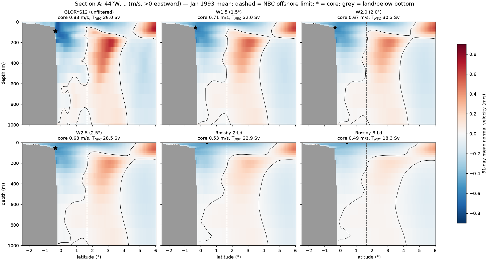
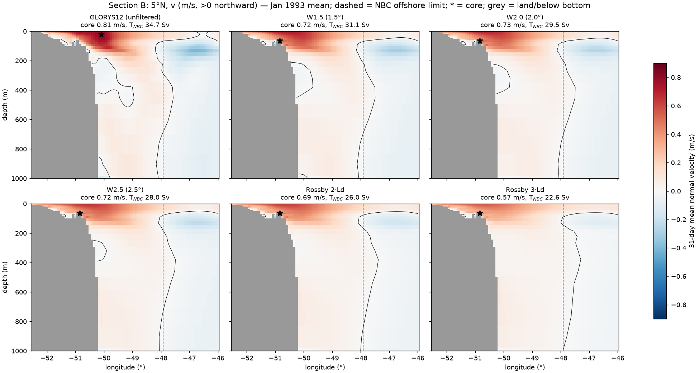
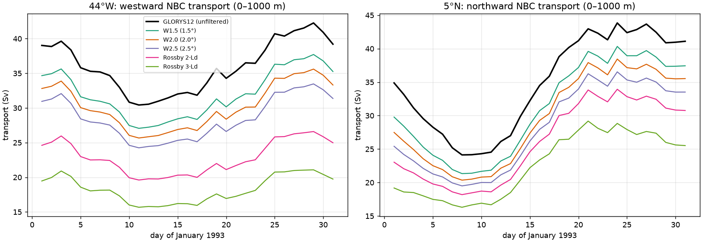

In both tables, T is the monthly mean of daily values over 0–1000 m (or 0–300 m). The net column is the net transport over the whole line, 0–1000 m, NBC-signed. Percentages are changes relative to ORIG.

**44°W (positive = westward)**

| Config | Core, monthly mean (m/s) | Core, robust 3-pt | Mean of daily max | Core depth | Width at ORIG core depth (km) | T 0–1000 m (Sv) | T 0–300 m (Sv) | Net, coast–6°N (Sv) |
|---|---|---|---|---|---|---|---|---|
| ORIG | 0.83 | 0.80 | 0.89 | 92 m | 121 | **36.0** | 26.9 | 23.5 |
| W1.5 | 0.71 (−15 %) | −19 % | 0.74 (−17 %) | 56 m | 153 | 32.0 (−11 %) | 25.0 (−7 %) | 22.9 (−3 %) |
| W2.0 | 0.67 (−20 %) | −23 % | 0.69 (−22 %) | 56 m | 157 | 30.3 (−16 %) | 24.0 (−11 %) | 22.7 (−4 %) |
| W2.5 | 0.63 (−25 %) | −28 % | 0.65 (−27 %) | 56 m | 161 | 28.5 (−21 %) | 22.9 (−15 %) | 22.5 (−5 %) |
| R2Ld | 0.53 (−36 %) | −34 % | 0.56 (−38 %) | 0.5 m | 180 | 22.9 (−37 %) | 19.1 (−29 %) | 22.5 (−4 %) |
| R3Ld | 0.49 (−42 %) | −40 % | 0.49 (−45 %) | 0.5 m | 210 | 18.3 (−49 %) | 15.7 (−42 %) | 22.0 (−7 %) |

**5°N (positive = northward)**

| Config | Core, monthly mean (m/s) | Core, robust 3-pt | Mean of daily max | Width at ORIG core depth (km) | T 0–1000 m (Sv) | T 0–300 m (Sv) | Net, coast–46°W (Sv) |
|---|---|---|---|---|---|---|---|
| ORIG | 0.81 | 0.80 | 0.97 | 224 | **34.7** | 24.7 | 14.9 |
| W1.5 | 0.72 (−10 %)\* | −12 % | 0.78 (−19 %) | 276 | 31.1 (−11 %) | 22.6 (−8 %) | 16.2 (+8 %) |
| W2.0 | 0.73 (−9 %)\* | −15 % | 0.76 (−22 %) | 296 | 29.5 (−15 %) | 21.6 (−12 %) | 16.8 (+12 %) |
| W2.5 | 0.72 (−11 %)\* | −18 % | 0.73 (−25 %) | 314 | 28.0 (−19 %) | 20.6 (−16 %) | 17.3 (+16 %) |
| R2Ld | 0.69 (−15 %)\* | −21 % | 0.70 (−28 %) | 315 | 26.0 (−25 %) | 19.0 (−23 %) | 18.8 (+26 %) |
| R3Ld | 0.57 (−29 %)\* | −29 % | 0.60 (−38 %) | 370 | 22.6 (−35 %) | 16.2 (−35 %) | 19.3 (+29 %) |

**Daily variability.** The standard deviation of daily T_A is 3.7 Sv in ORIG, 3.4, 3.2 and 3.0 Sv for W1.5–W2.5, and 2.4 and 1.9 Sv for R2Ld and R3Ld. For T_B it is 7.1 Sv in ORIG and between 6.9 and 4.6 Sv in the filters.

**Artefact at 5°N (marked \*).** In every v3 config, the single-cell maximum at 5°N sits at one V point (50.83°W, 66–78 m). That point is wedged against a one-cell bathymetric notch and has land on its western side. There v3 gives 0.73 m/s (W2.0), while ORIG has 0.26 m/s and the neighbouring points about 0.5 m/s. It is a local v3 wall artefact, plausibly because no curl constraint acts at a V point enclosed by land, so only the divergence term shapes it.
- The transport through the section is not affected: 66 m cells there are about 10 km × 10 m, so the anomaly is well below 0.1 Sv.
- The table therefore also gives the robust 3-point core, which is 0.68 m/s at 8 m for W2.0.

**Interpretation**
- **ORIG jet.** At 44°W the NBC is a narrow slope-trapped jet, 0.83 m/s at 92 m and about 120 km wide. Offshore of it lies an eastward subsurface current (2–3.5°N, 100–500 m) that feeds the retroflection and the equatorial undercurrents.
- **Where the "lost" transport goes.** The westward-only NBC transport in the fixed region drops by 11 % (W1.5) to 49 % (R3Ld). The net transport over the whole section changes by only −3 % to −7 %. The filter conserves area integrals level by level; the jet is widened across the section and cancels partly against the adjacent eastward flow.
- **Re-evaluated for v3.** This redistribution is a genuine property of any low-pass filter applied to a narrow jet next to an opposing current. It is **not** the v1 wall artefact: v1 and v3 give nearly the same NBC transport, see section 5. At 5°N the same mechanism *raises* the net transport (+8 % to +29 %), because the offshore southward recirculation is smoothed away.
- **Core depth.** For R2Ld and R3Ld the 44°W core moves to the surface: the subsurface slope jet is weakened more than the broad surface SEC/NBC flow. Widths are therefore given at the ORIG core depth.
- **Which filters are strongest here.** ℓ is 126–188 km at the equator for R2Ld/R3Ld, against 48–79 km for W1.5–W2.5, so the Rossby-radius filters are the most aggressive at NBC latitudes. R3Ld halves the westward transport at 44°W.

#### 2. Kinetic energy

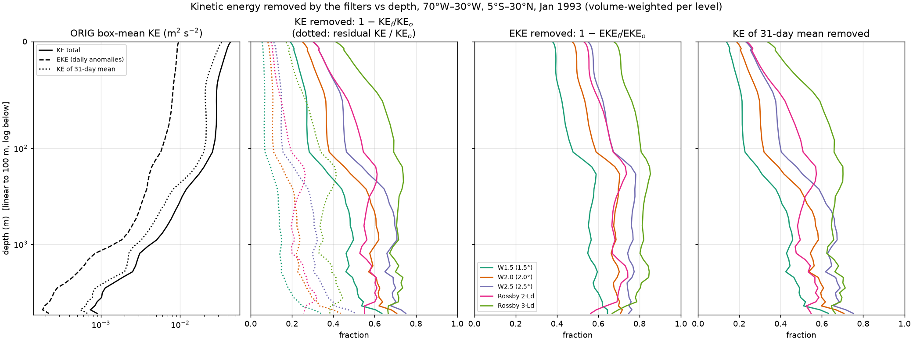
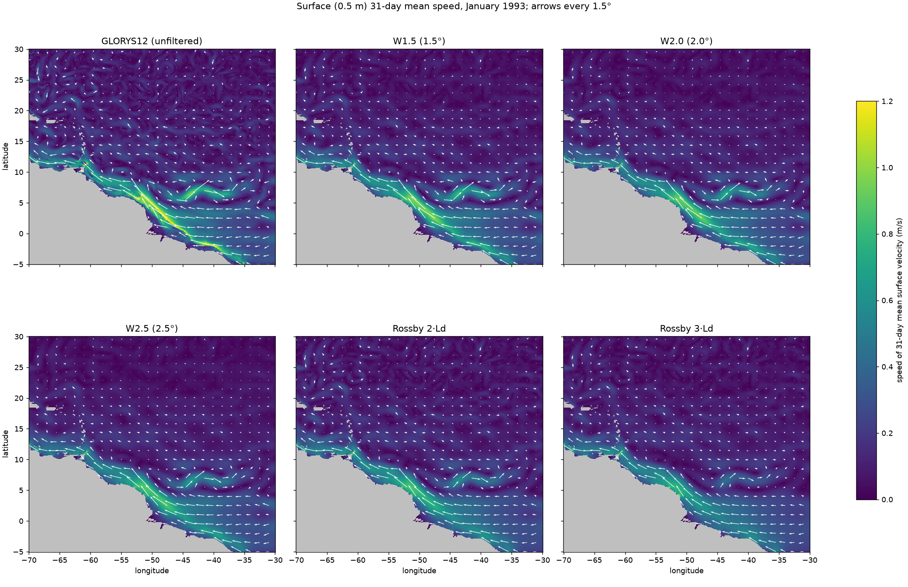
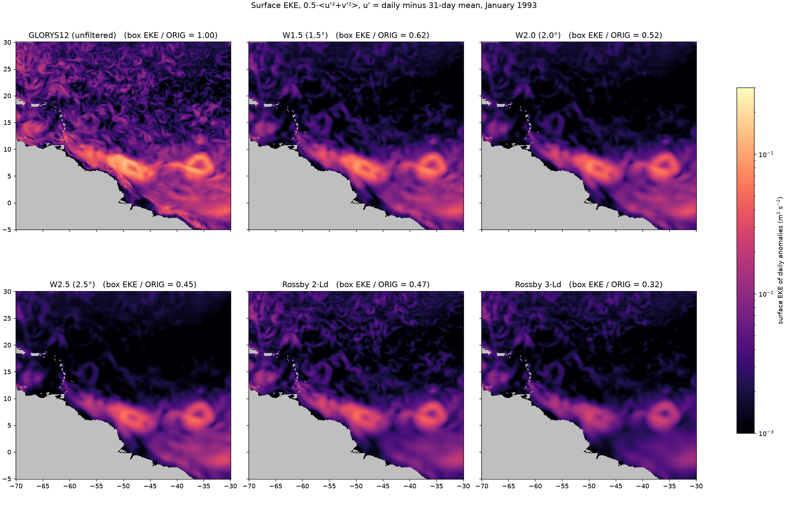

**ORIG box means**

| Depth range | KE (m²/s²) | EKE / KE |
|---|---|---|
| 0–200 m | 0.026 | 0.24 |
| 0–1000 m | 0.0115 | 0.30 |
| Full depth | 0.0039 | 0.28 |

The region is dominated by the mean flow in January 1993.

**Fractions removed by each filter.** KE removed = 1 − KE_f/KE_o; EKE removed = 1 − EKE_f/EKE_o. "Mean-flow KE" is the KE of the 31-day mean. "Residual KE" is ½⟨|u_o − u_f|²⟩ / KE_o.

| Config | KE removed 0–200 m | KE removed 0–1000 m | KE removed full | EKE removed 0–200 m | EKE removed 0–1000 m | EKE removed full | Mean-flow KE removed 0–1000 m | Residual KE 0–1000 m |
|---|---|---|---|---|---|---|---|---|
| W1.5 | 0.28 | 0.38 | 0.42 | 0.46 | 0.53 | 0.54 | 0.32 | 0.11 |
| W2.0 | 0.37 | 0.49 | 0.53 | 0.57 | 0.64 | 0.66 | 0.43 | 0.17 |
| W2.5 | 0.45 | 0.57 | 0.61 | 0.65 | 0.73 | 0.73 | 0.51 | 0.24 |
| R2Ld | 0.49 | 0.53 | 0.55 | 0.64 | 0.66 | 0.67 | 0.48 | 0.20 |
| R3Ld | 0.64 | 0.68 | 0.69 | 0.78 | 0.81 | 0.81 | 0.63 | 0.33 |

**Interpretation**
- **Two measures of "energy removed".** 1 − KE_f/KE_o is 2–4 times larger than the residual fraction. The reason is the cross term: KE_o = KE_f + residual + 2⟨u_f·(u_o − u_f)⟩. The Lorentzian transfer function G = 1/(1 + ½ℓ²K²) damps every scale partly; it does not project the flow onto large and small scales. Both measures are reported.
- **Depth dependence.** The removed fraction increases with depth. The weak deep flow is more dominated by narrow, topographically steered structures; this is an interpretation and was not checked with a spectrum.
- **Surface EKE.** Box surface EKE ratios are 0.62, 0.52, 0.45, 0.47 and 0.32 (W1.5 to R3Ld). All filters keep the NBC–retroflection EKE corridor. The W filters largely erase the surface mesoscale north of 15°N. The Rossby filters keep it there (Ld is 44–65 km) but damp the equatorial band strongly.

#### 3. Large-scale and "seasonal" retention

**Only January 1993 is available, so no seasonal cycle can be computed.** The 31-day mean and 10°-smoothed fields serve as proxies.

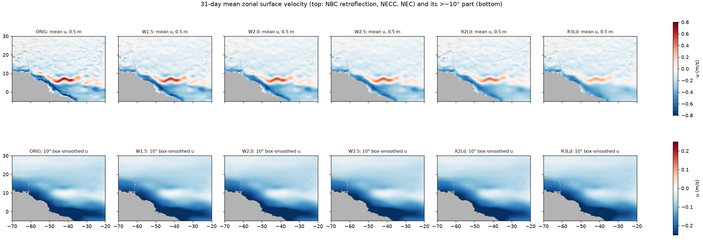
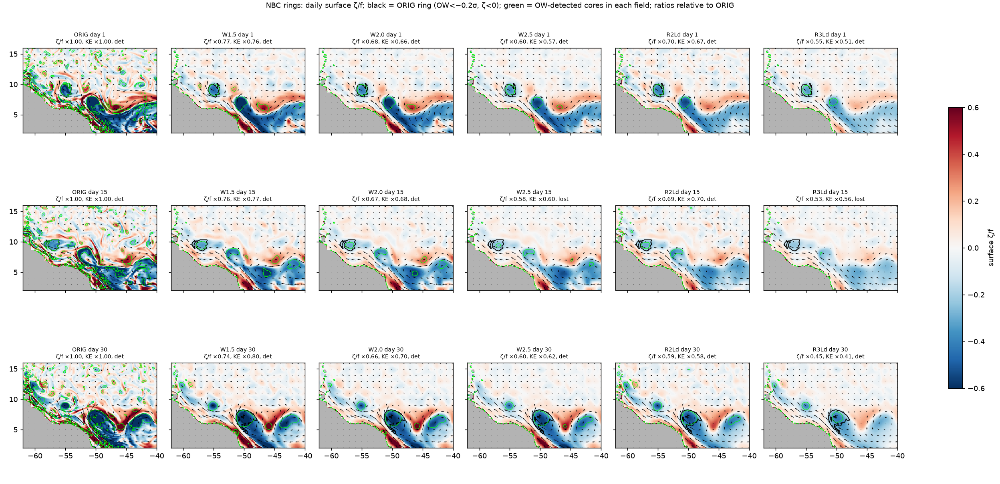

**(i) 31-day-mean circulation.** Centred vector pattern correlation with ORIG; the value in brackets is the relative RMS difference.

| Config | Retroflection 52–42°W, 3–10°N, 0.5 m | Retroflection, 92 m | NECC 40–20°W, 4–10°N, 0.5 m | NEC 60–30°W, 10–20°N, 0.5 m |
|---|---|---|---|---|
| W1.5 | 0.993 (0.13) | 0.984 (0.21) | 0.993 (0.17) | 0.955 (0.23) |
| W2.0 | 0.988 (0.19) | 0.975 (0.27) | 0.987 (0.24) | 0.924 (0.30) |
| W2.5 | 0.981 (0.24) | 0.966 (0.33) | 0.979 (0.31) | 0.888 (0.35) |
| R2Ld | 0.975 (0.29) | 0.957 (0.39) | 0.968 (0.37) | 0.960 (0.22) |
| R3Ld | 0.945 (0.42) | 0.926 (0.54) | 0.935 (0.53) | 0.913 (0.32) |

- The retroflection loop and the eastward jet at 6–8°N stay recognisable in all configs, with peak speeds reduced.
- In the NEC band the Rossby filters keep more structure than W2.0 and W2.5.

**(ii) Large scales (>~10°).** A NaN-aware 121×121-point box (about 10°) was applied to the full-domain monthly means of ORIG and each filter.

| Config | Relative RMS difference, 0.5 m | Relative RMS difference, 92 m |
|---|---|---|
| W1.5 | 0.010 | 0.035 |
| W2.0 | 0.015 | 0.057 |
| W2.5 | 0.022 | 0.082 |
| R2Ld | 0.038 | 0.15 |
| R3Ld | 0.070 | 0.23 |

- Pattern correlations are all ≥0.979. Only 0.1–1.5 % of the KE of the removed mean flow survives the 10° smoothing. The >10° circulation is essentially untouched; this is partly by construction, because the filter conserves area integrals.
- The larger 92 m difference for R2Ld/R3Ld reflects a weak large-scale flow at that depth (box-mean u = −0.011 m/s) plus the across-section redistribution next to the coast.

**(iii) NBC rings.** Rings were detected in ORIG from daily surface ζ and Okubo–Weiss (OW < −0.2 σ, ζ < 0, OW-core diameter > 100 km). Three cases were followed:
- 1 January: a shed ring at 54.9°W, 9.0°N (204 km core).
- 15 January: the same ring after drifting NW to 57.1°W, 9.5°N.
- 30 January: a ring forming at the retroflection, 49.8°W, 6.8°N (318 km).

| Config | Ring KE retained (1 Jan / 15 Jan / 30 Jan) | Detected anticyclones per day (ORIG: 3.3) |
|---|---|---|
| W1.5 | 0.76 / 0.77 / 0.80 | 2.2 |
| W2.0 | 0.66 / 0.68 / 0.70 | 2.0 |
| W2.5 | 0.57 / 0.60 / 0.62 | 1.7 |
| R2Ld | 0.67 / 0.70 / 0.58 | 2.1 |
| R3Ld | 0.51 / 0.56 / 0.41 | 1.2 |

- The ring is still detected on all dates, except W2.5 and R3Ld on 15 January. There the OW core remains visible but covers less than 30 % of the ORIG core.
- **No filter removes the rings; all of them weaken them.** Sub-100 km eddies and filaments disappear in every config.

#### 4. Vertical velocity at 44°W

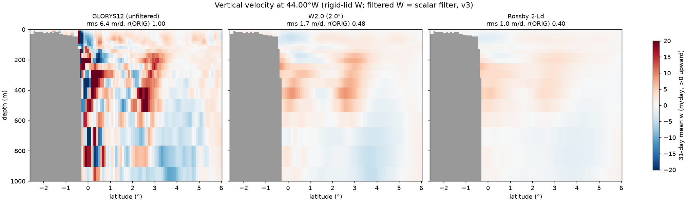

| Field | rms of 31-day-mean w (m/day) | rms of daily w (m/day) | Correlation of mean pattern with ORIG |
|---|---|---|---|
| ORIG (rigid-lid) | 6.4 | 11.7 | 1 |
| W2.0 | 1.7 | 2.9 | 0.48 |
| R2Ld | 1.0 | 1.6 | 0.40 |

- The ORIG W is dominated by vertically alternating grid-scale columns over the continental slope (±20–70 m/day between −0.5°N and 1°N), i.e. slope-following up- and downwelling at the model's step topography. It also shows banded upwelling at 2–3°N, 200–500 m, below the eastward undercurrent.
- The scalar filter removes the slope noise and keeps the smooth large-scale pattern: weak upwelling of up to 9 m/day at 200–500 m, weak downwelling below 600 m offshore. Amplitude drops by a factor of 4 (W2.0) to 7 (R2Ld).
- W is filtered as a scalar rather than derived from the filtered U,V. Any residual inconsistency with filtered continuity is diagnosed in the coordinator's continuity residual R, not here.

#### 5. v1 (component-wise) vs v3 (vector div–rot)

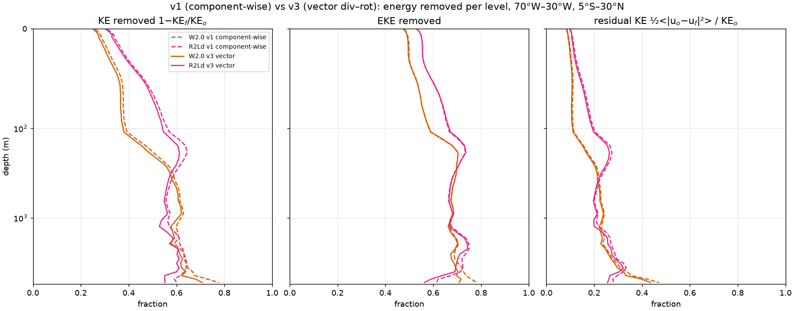

Near-coast speed is the 31-day-mean surface speed, averaged over wet T points within 50 km of land (70°W–30°W, 5°S–30°N); the ORIG value is 0.258 m/s.

| Metric | W2.0 v1 | W2.0 v3 | R2Ld v1 | R2Ld v3 |
|---|---|---|---|---|
| 44°W core, single cell | −28 % | −20 % | −36 % | −36 % |
| 44°W core, robust 3-pt | −25 % | −23 % | −33 % | −34 % |
| 5°N core, robust 3-pt | −16 % | −15 % | −23 % | −21 % |
| 44°W T 0–1000 m | 29.9 Sv (−17 %) | 30.3 Sv (−16 %) | 21.9 Sv (−39 %) | 22.9 Sv (−37 %) |
| 44°W net, whole section | −6 % | −4 % | −7 % | −4 % |
| 5°N T 0–1000 m | −15 % | −15 % | −25 % | −25 % |
| KE removed, 0–200 m / 0–1000 m / full | 0.39 / 0.50 / 0.54 | 0.37 / 0.49 / 0.53 | 0.51 / 0.55 / 0.57 | 0.49 / 0.53 / 0.55 |
| EKE removed, 0–200 m / 0–1000 m / full | 0.57 / 0.64 / 0.66 | 0.57 / 0.64 / 0.66 | 0.63 / 0.66 / 0.68 | 0.64 / 0.66 / 0.67 |
| Near-coast surface speed | 0.275 (×1.07) | 0.282 (×1.09) | 0.291 (×1.13) | 0.295 (×1.14) |

**What the switch to v3 changed**
- **Open ocean and energetics: practically identical.** EKE removed differs by ≤0.01. KE removed is 0.01–0.02 lower in v3, because less mean-flow KE is lost along coasts.
- **Along coasts, v3 keeps slightly more of the slope jets.**
  - The single-cell 44°W NBC core loses 20 % in v3 instead of 28 % for W2.0. Most of that gain sits in the wall-adjacent cell (free slip, no wall-induced convergence); the robust 3-point core differs by only 1–2 points.
  - NBC transports are 1–3 % of ORIG higher in v3, and the net section loss shrinks from −6/−7 % to −4 %.
- **Near-coast surface speed.** Both versions raise the 0–50 km mean speed above ORIG, because smoothing spreads the fast slope jets onto slow shelves. v3 raises it 2–3 points more.
- **Shelf structure.** v3 keeps closed shelf pockets separate from the slope flow; v1 diffused across them. For example, at 5°N, 51.5°W, 66 m: ORIG −0.03 m/s, v1 +0.18, v3 +0.01.
- **Transport redistribution caveat, revisited.** With v3 the across-section redistribution of NBC transport remains: 16 % (W2.0) to 49 % (R3Ld) of the westward NBC transport is moved outside the fixed NBC region. It is therefore a property of the scale separation, not of the v1 wall treatment.
- **New v3 artefact:** isolated single-cell velocity maxima at V/U points trapped in one-cell bathymetric notches (5°N, 50.83°W, 66–78 m: 0.73 against 0.26 m/s in ORIG). They are harmless for transports and energy but bias single-cell "maximum speed" metrics.

#### 6. Summary and assessment

The NBC core column uses the robust 3-point core. Transport is westward-only in the fixed NBC region at 44°W and northward-only at 5°N, both 0–1000 m. Retroflection correlation is the surface pattern correlation.

| Config | Total KE removed (0–1000 m / full) | EKE removed (0–1000 m / full) | NBC core change, 44°W / 5°N | NBC transport change, 44°W / 5°N | Retroflection correlation | Ring KE retained |
|---|---|---|---|---|---|---|
| W1.5 | 0.38 / 0.42 | 0.53 / 0.54 | −19 % / −12 % | −11 % / −11 % | 0.993 | 0.78 |
| W2.0 | 0.49 / 0.53 | 0.64 / 0.66 | −23 % / −15 % | −16 % / −15 % | 0.988 | 0.68 |
| W2.5 | 0.57 / 0.61 | 0.73 / 0.73 | −28 % / −18 % | −21 % / −19 % | 0.981 | 0.60 |
| R2Ld | 0.53 / 0.55 | 0.66 / 0.67 | −34 % / −21 % | −37 % / −25 % | 0.975 | 0.65 |
| R3Ld | 0.68 / 0.69 | 0.81 / 0.81 | −40 % / −29 % | −49 % / −35 % | 0.945 | 0.50 |

**Assessment by configuration**
- **W1.5, mildest.** Half of the EKE is removed. NBC transport stays within 11 %, the mean circulation is almost unchanged (r ≥ 0.98), and rings keep about 78 % of their KE. The narrow subsurface NBC core still loses about 19 %.
- **W2.0, balanced.** Two-thirds of the EKE is removed. NBC transport drops by 15–16 %; rings are clearly weakened but intact.
- **W2.5, strong eddy removal (73 % of EKE).** NBC transport drops by about 20 %, and the mesoscale north of 15°N is nearly erased.
- **R2Ld, scale-aware but aggressive at the equator.** Box energetics are close to W2.5, but the NBC loses 37 % of its westward transport at 44°W. It preserves the NEC-band mesoscale best (r = 0.96).
- **R3Ld, most aggressive.** 81 % of EKE and 68 % of KE are removed. NBC transport at 44°W and ring KE are roughly halved, the retroflection correlation falls to 0.945, and the 92 m large-scale difference reaches 23 %. At these latitudes this is no longer a clean eddy/mean separation.

**Caveats**
- EKE here means intra-monthly variability only.
- Near 30°N the filter has no halo; the effect on the box metrics is ≤0.02.
- Single-cell core metrics are affected by the v3 notch artefact; use the robust 3-point core.

## 5. Boundary behaviour: shelf, Amazon mouth, islands, passages, domain edges

**Verdict (v3).** The v3 boundaries are numerically clean. They are also physically much better than v1 where it matters most: passages and coast-normal flow.

What is clean:
- Land faces stay NaN (0 mismatches), so no flow crosses the coast.
- The CPU re-implementation reproduces the GPU output (U,V 6·10⁻⁸ m/s; W 1.5·10⁻¹¹ m/s).
- W obeys the maximum principle.

What v3 fixed:
- Lesser Antilles transport is now conserved: arc sum −20.63 to −20.65 Sv vs ORIG −20.82 Sv. v1 lost 33–53 % of it.
- The spurious amplification of flow normal to the coast at the first wet faces is roughly halved.

Four boundary effects remain. They are intrinsic to a horizontal, level-by-level smoother with a free-slip wall, not bugs:
(i) the mean speed within ~45 km of the coast rises by +12…+29 %, unchanged from v1;
(ii) KE of the depth-mean flow on the shelf grows by 22–29 %, because the filter mixes across the shelf break;
(iii) the slope current at ~1000 m is damped more than the flat deep ocean;
(iv) a domain cut perturbs the first row by 45–100 % of the filtered signal for U,V (v1: 38–45 %). The error decays as exp(−d·√2/ℓ), and **a 1 % margin is ≈ 5 λ ≈ 3.5 ℓ, about one filter box width.** At the 30°N edge that is 0.6–2.2° depending on the config.

W (scalar filter of the rigid-lid W) shows **no boundary artefact**. It removes the ±20–30 m/day grid-scale noise that ORIG W carries along the coast and the shelf break.

Scripts: `accumulate.py` (SLURM, monthly U/V/W statistics), `boundary_stats.py`, `maps.py`, `passages.py`, `edge_test.py`, `validate_cpu.py`, `mask_check.py`, `check_overshoot.py`, `assemble_metrics.py`, driver `run_all_v3.sh`. All numbers, including the block `v1_vs_v3`, are in `analysis/boundaries/metrics.json`. The earlier v1 section, figures and metrics are archived in `analysis/boundaries/v1/`.

#### Method (unchanged from v1 unless noted)
- **Monthly statistics.** Per config, streamed over 31 days × 50 levels × the whole domain: mean, mean square and mean squared daily (filtered − ORIG) difference for U, V and (new) W.
  - ORIG W is the rigid-lid `W_1993-01fc.nc`.
  - NaN-mask identity check.
  - Range check: filtered values must stay within [min, max] of ORIG per connected wet region. It is exact for the scalar W filter. For the coupled U,V vector operator it is only a diagnostic.
- **Distance from the coast.** Euclidean distance transform of each grid's own wet mask at the level. The analysis domain is 70–30°W, 5°S–30°N, without the last row and column.
- **Regions.** By bottom depth: shelf H < 200 m, slope 200–1000 m, deep H > 3000 m. Weights e1·e2·e3.
- **First wet faces normal to the coast.** A wet U point whose U(i±1) neighbour is land; a wet V point whose V(j±1) neighbour is land. Onshore is positive.
- **Passage transports.** Staircase sections along cell edges between land cells, full depth, daily.
- **Domain edges.**
  - CPU re-run of the production operators on 80–20°W, 1 Jan: `filter_level_vector` for U,V at the surface, the scalar T filter for W at 101 m. Each box is filtered twice, with an artificial wall (at 25°N or 0°) and with the real halo beyond it.
  - New: the daily surface-layer continuity residual R from `diag_<CFG>.npz`, profiled against distance from the 30°N, 10°S and 95°W edges (points > 300 km from any coast). The residual statistics themselves are in the spectra/divergence section; only the boundary dependence is shown here.

#### Summary: v1 (component-wise, Neumann) vs v3 (vector div–rot, free slip)

| Problem found in v1 | v1 | v3 | Status |
|---|---|---|---|
| Max coastal speed ratio in 0–45 km (W1.5 / W2.0 / W2.5 / R2Ld / R3Ld) | 1.12 / 1.16 / 1.20 / 1.24 / 1.31 | 1.13 / 1.18 / 1.22 / 1.24 / 1.29 | **not fixed** (intrinsic) |
| Speed ratio, first bin 0–13 km | 1.06–1.22 | 1.12–1.24 | slightly higher (free slip) |
| RMS mean onshore velocity at first wet faces (ORIG 12.4 cm/s) | 17.8–21.1 (+44…+71 %) | 14.6–16.8 (+18…+36 %) | **halved** |
| Correlation with ORIG at those faces | 0.80–0.85 | 0.87–0.89 | better |
| Σ\|onshore transport\| at first wet faces (ORIG 0.99 Sv) | 1.48–1.83 Sv | 1.10–1.26 Sv | better |
| Lesser Antilles arc sum (ORIG −20.82 Sv) | −9.8 … −13.9 | −20.63 … −20.65 | **fixed** (−0.9 %) |
| St Vincent Passage (ORIG −5.84 Sv) | −1.9 … −3.1 | −5.84 … −5.86 | **fixed** |
| St Lucia Channel (ORIG −5.56 Sv) | −1.5 … −3.1 | −5.54 | **fixed** |
| Guadeloupe Passage (ORIG −0.040 Sv) | −0.19 … −0.52 | −0.040 … −0.048 | **fixed** |
| Dragon's Mouth (ORIG +0.123 Sv) | +0.05 … +0.06 | +0.14 … +0.15 | better; now +16…+25 % |
| Shelf depth-mean-flow KE retained | 1.23–1.34 | 1.22–1.29 | **not fixed** (cross-shelf-break mixing) |
| Slope vs deep speed ratio at 1062 m, W2.0 | 0.66 vs 0.74 | 0.62 vs 0.74 | slightly worse |
| Slope vs deep speed ratio at 1062 m, R2Ld | 0.43 vs 0.54 | 0.38 vs 0.54 | slightly worse |
| Edge: relative error in the first row (U,V) | 0.38–0.45 | 0.45–1.03 | worse at the wall |
| Edge: 1 % distance, north wall (U,V) | 76–211 km | 76–203 km | unchanged |
| Edge: d(1 %)/λ, all tests | 2.5–4.7 | 3.0–4.9 | unchanged |
| North-edge EKE-retained uptick, 29–30°N minus 25–29°N, surface | +0.07 (W2.0, R2Ld) | +0.15 (W2.0), +0.09 (R2Ld) | larger |

#### 1. Masks, no-flux and range checks
- **NaN masks.** The ORIG U/V NaN mask equals the C-grid mask on all levels. The filtered U, V, W masks are identical for all 5 configs (0 mismatches). There is exactly zero flow through the coast.
- **W range check.** Exceedance 0.0: the scalar filter is a positive averaging operator.
- **U,V range check.**
  - The vector operator has no maximum principle. Values leave the component-wise regional range by more than 1 mm/s at ~1·10⁻⁴ of wet points.
  - The largest cases (0.3–0.5 m/s) are isolated single-face U or V pockets (1–2 wet points of one component, connected only through the other component). The coupled operator damps them almost to zero.
    - Examples: Serpent's Mouth, 62.0°W 10.0°N at 16 m, u −0.41 → −0.01 m/s; 44.3°W 1.3°S; 54.9°W 6.2°N (`metrics.json → overshoot`). This is strong local damping in 1-cell inlets, not ringing.
  - One real overshoot sits in a large connected region: the Yucatán/Cozumel channel, 86.9°W 20.7°N at 78 m, u 0.93 → 1.45 m/s. It is outside the analysis domain.
  - V in the last column (9.9°E) is also amplified (0.03 → 0.14 m/s). This is an edge effect, covered in section 9.

#### 2. Coast-normal flow and the residual near the coast (task 2c)

| | W1.5 | W2.0 | W2.5 | R2Ld | R3Ld |
|---|---|---|---|---|---|
| RMS monthly-mean onshore velocity, first wet faces [cm/s] (ORIG 12.4) | 14.6 | 15.5 | 16.1 | 16.1 | 16.8 |
| Correlation with ORIG | 0.89 | 0.88 | 0.87 | 0.89 | 0.87 |
| RMS daily change [cm/s] (ORIG daily RMS 13.0) | 7.1 | 8.0 | 8.7 | 8.2 | 9.1 |
| Net onshore transport [Sv] (ORIG −0.040) | −0.065 | −0.068 | −0.070 | −0.078 | −0.078 |

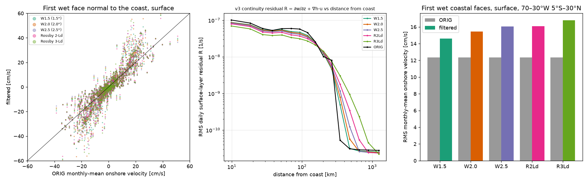

- **v1 → v3.** The one-cell convergence line along every wall in v1 is gone. The filtered divergence is the no-flux scalar filter of the original divergence. Normal flow at the first wet faces is still somewhat amplified, +18…+36 %, because the smoothing kernel is one-sided at the wall. That is half of v1.
- **Residual near the coast.** The continuity residual R of v3 is ~1·10⁻⁷ s⁻¹ within 100 km of the coast, *the same as ORIG*. There it contains river runoff, E−P and the rigid-lid correction.
  - Offshore of 300 km, R is 10⁻¹⁰–10⁻⁸ s⁻¹ (ORIG 3·10⁻¹¹). **The filter adds no coastal residual.**

#### 3. Distance from the coast (task 2a)

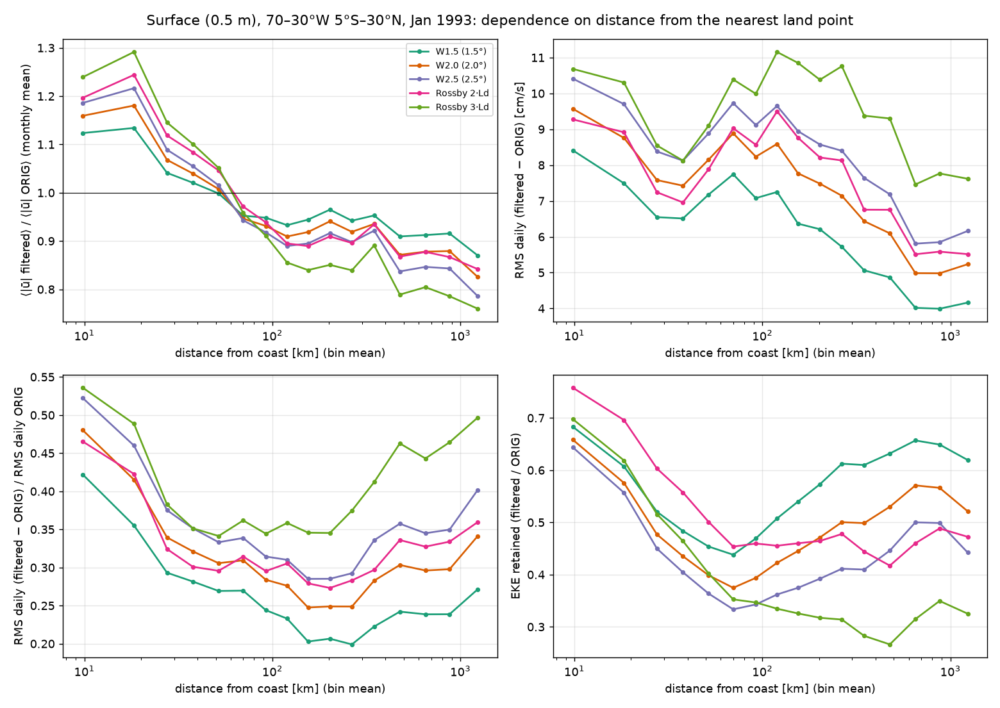

- **Mean speed at the surface.** The ratio of monthly-mean speed is **> 1 within ~45–60 km of every coast** in v3, as in v1:
  - 0–13 km: 1.12 / 1.16 / 1.19 / 1.20 / 1.24 (W1.5 / W2.0 / W2.5 / R2Ld / R3Ld)
  - 13–22 km (peak): 1.13–1.29
  - 45–60 km: 1.00–1.05
  - beyond 750 km: 0.76–0.92

  The monotonicity is the same as in v1. 38–54 % of coastal points with ORIG speed > 5 cm/s gain more than 20 %.
- **Why.** The fast NBC and Guiana Current are averaged into the slow coastal band. With free slip the tangential velocity is not pulled to zero at the wall. So the effect is intrinsic to a free-slip horizontal smoother and was not caused by the v1 Neumann walls.
- **Daily differences.** Relative RMS daily difference is 0.42–0.54 at 0–13 km (v1 0.52–0.64), falling to 0.20–0.35 at 100–300 km.
- **EKE retained.** 0.64–0.76 at 0–13 km (v1 0.40–0.62) vs 0.33–0.47 at 45–80 km. It is still non-monotonic, and higher at the coast than in v1.
- **At depth.** Near the coast v3 keeps more mean speed than v1:
  - 110 m, first two bins: 0.90–1.04 (v1 0.77–0.99)
  - 454 m, first bin: 0.73–0.83 (v1 0.58–0.71)

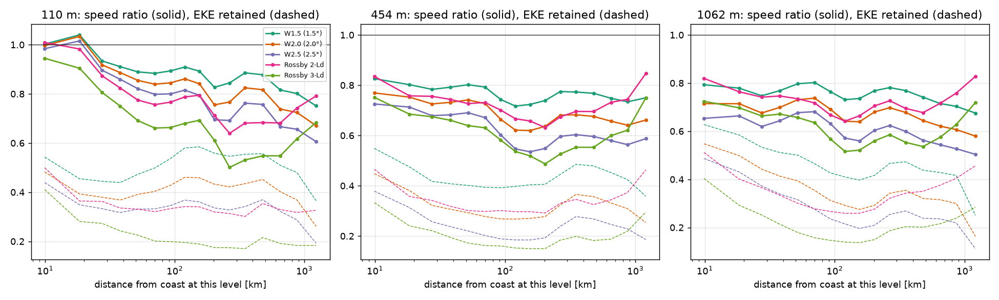

#### 4. Shelf, slope and deep ocean (task 2b)

| v3 | KE retained, full depth (shelf / slope / deep) | EKE retained (shelf / slope / deep) | Depth-mean flow: rel. RMS change (shelf / slope / deep) | Depth-mean KE retained, shelf (v1) |
|---|---|---|---|---|
| W1.5 | 0.99 / 0.75 / 0.56 | 0.58 / 0.47 / 0.46 | 0.29 / 0.26 / 0.35 | **1.22** (1.23) |
| W2.0 | 0.97 / 0.68 / 0.45 | 0.51 / 0.38 / 0.34 | 0.33 / 0.31 / 0.46 | **1.27** (1.30) |
| W2.5 | 0.95 / 0.61 / 0.36 | 0.46 / 0.31 / 0.27 | 0.37 / 0.35 / 0.54 | **1.29** (1.34) |
| R2Ld | 0.89 / 0.60 / 0.44 | 0.49 / 0.37 / 0.33 | 0.37 / 0.37 / 0.39 | **1.27** (1.33) |
| R3Ld | 0.78 / 0.47 / 0.29 | 0.38 / 0.24 / 0.19 | 0.42 / 0.46 / 0.53 | **1.22** (1.33) |

- **Shelf and slope KE.** Slope KE is better retained than in v1 (e.g. W2.0 0.68 vs 0.59). Deep-ocean EKE is unchanged (±0.005).
- **Shelf depth-mean flow still gains 22–29 % KE.** Level by level, the upper layers of the shelf are connected to the NBC over the slope, and the filter spreads NBC momentum onto the shelf.
  - Along 5°N the shelf-mean surface speed barely changes (ORIG 0.76; filtered 0.71–0.76 m/s).
  - The NBC core at the shelf break drops from 1.12 to 0.77–0.96 m/s, and the innermost shelf points gain speed.

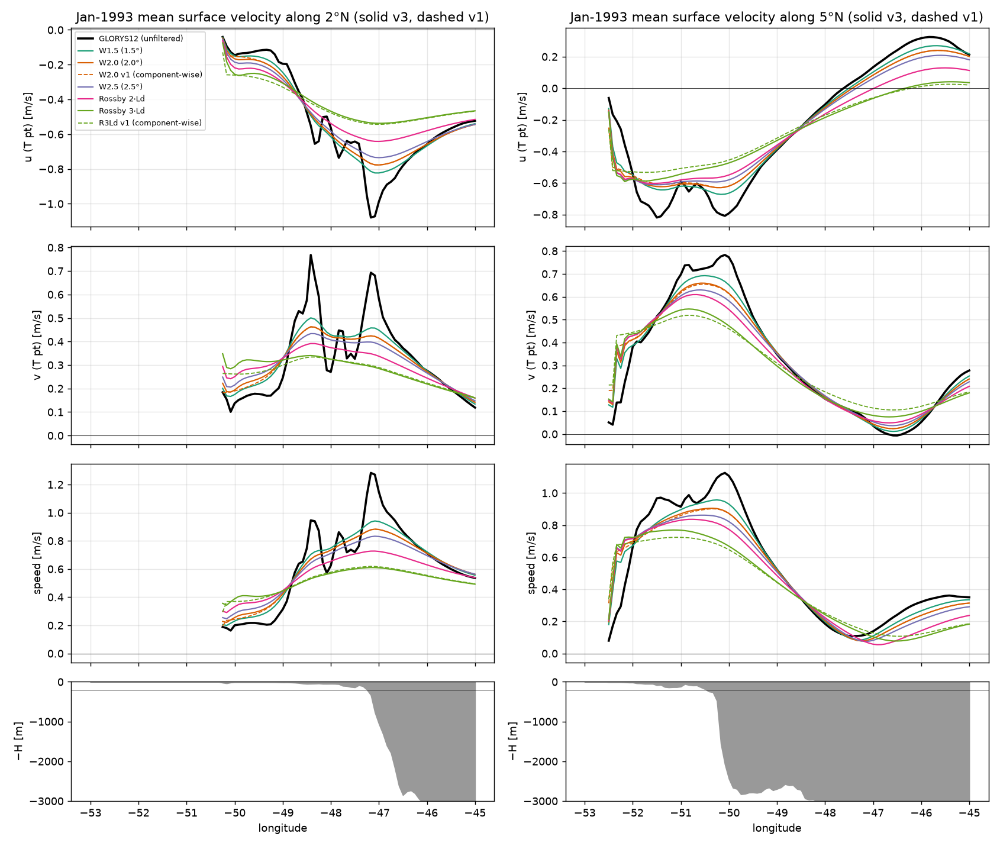

#### 5. Amazon shelf and mouth maps (task 1)

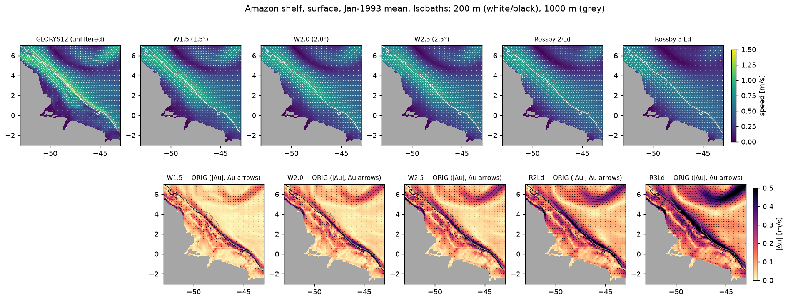
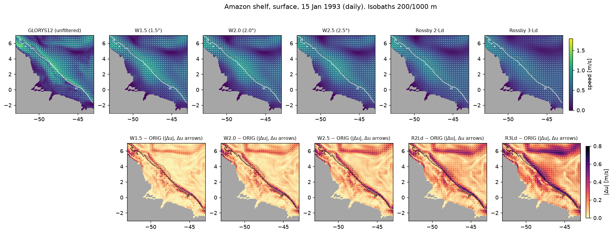
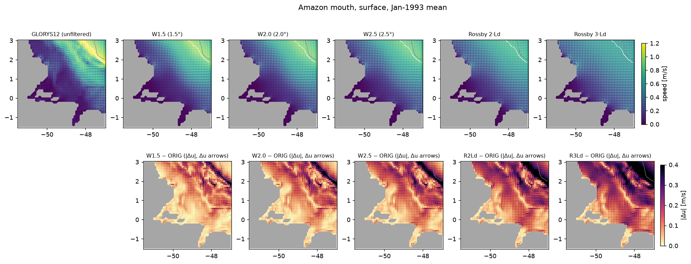

- **No wall artefacts.** No sign alternation, wall-parallel jets or checkerboards in U,V at the coast or in the estuary channels.
- **Where the differences are.** They concentrate on:
  - the NBC core along the 200 m isobath: |Δu| 0.3–0.5 m/s in the monthly mean, up to 0.8 m/s daily (R3Ld);
  - the small mid-shelf jets, which are removed;
  - for R2Ld/R3Ld, the retroflection eddy at 45°W 6°N.
- **v1 coastal jump gone.** In the 2°N transect, v1 had a jump in the first coastal U cell (−0.26 m/s vs ORIG −0.05). v3 does not (−0.07 m/s).

#### 6. W boundaries (new)

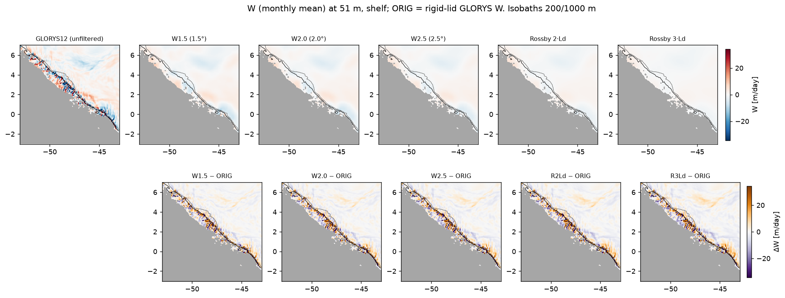
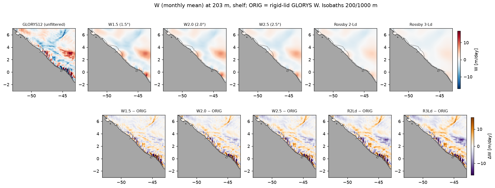
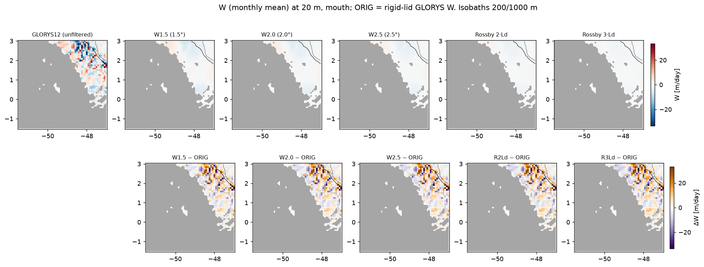
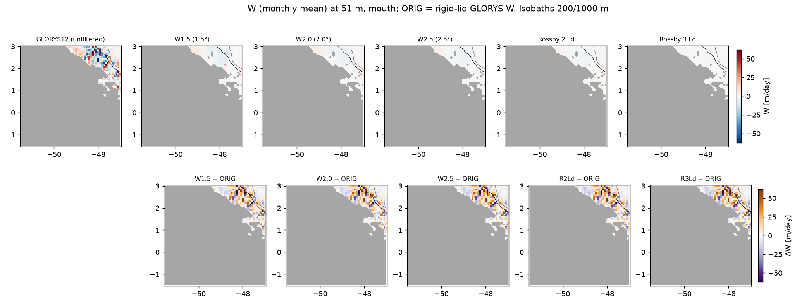
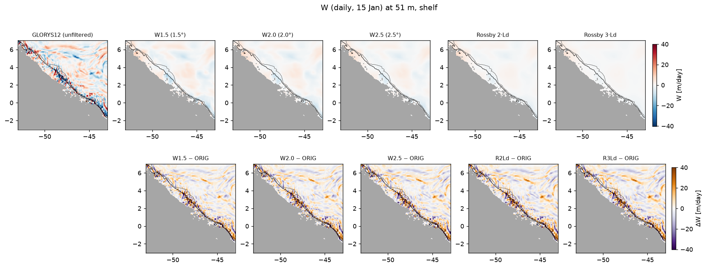
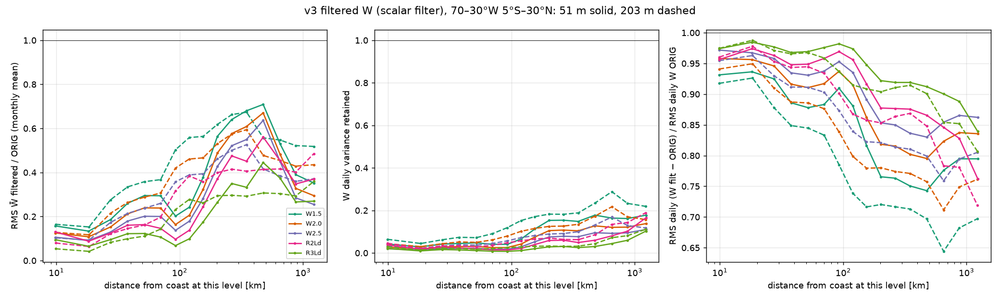

- **ORIG W is noisy at walls.** It carries grid-scale ±20–30 m/day alternating structure along the coast and the shelf break. This comes from GLORYS partial cells and topography, not from the filter.
  - 51 m shelf box: monthly-mean RMS W is 23.2 m/day in the first wet cell vs 16.8 at 3–10 cells from land.
  - 203 m: 19.4 vs 10.5 m/day.
- **Filtered W is smooth up to the wall, with no coastal banding.** First-wet-cell vs 3–10-cell RMS:
  - 51 m shelf: 1.2–3.4 vs 1.0–3.4 m/day
  - 203 m: 0.7–3.2 vs 0.7–2.9 m/day
  - Amazon mouth, 20 m: 0.3–1.3 vs 0.5–1.8 m/day
- **Coastal W variance.** Within 50 km of the coast, filtered W keeps only 1–6 % of the daily W variance, vs 10–29 % far offshore. The monthly-mean RMS ratio is 0.05–0.16 at the coast and 0.3–0.7 at 200–500 km.
  - W is dominated by grid-scale variability that ℓ ≫ Δx removes. The coastal noise is removed most strongly because it is the most grid-scale.
- **Lesser Antilles W at 51 m.** ORIG has ±10 m/day dipoles at every island tip (RMS 5.5 m/day in 62.5–59.5°W, 10.5–16.5°N). Filtered W is a smooth upwelling lobe in the lee of Grenada/Tobago (RMS 0.85–1.39 m/day), and nothing crosses the islands.
- **No land leakage.** The scalar W filter cannot smooth across land, and filtered W respects the level mask at the shelf break (fig. 203 m).

#### 7. Shelf break at depth (task 4)

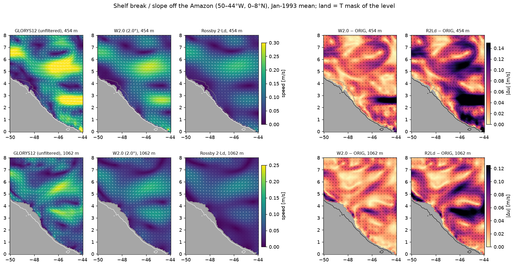

Region 50–44°W, 0–8°N, v3 mean speed ratio:

| Depth | Config | Slope (H < 3000 m) | Deep (H > 3000 m) |
|---|---|---|---|
| 454 m | W2.0 | 0.80 | 0.75 |
| 454 m | R2Ld | 0.57 | 0.54 |
| 1062 m | W2.0 | **0.62** | 0.74 |
| 1062 m | R2Ld | **0.38** | 0.54 |

The narrow deep western boundary current on the steep slope at ≈49–50°W, 4–5.5°N is only 1–3 cells wide. It is diluted by the one-sided kernel, slightly more than in v1 (0.66 / 0.43). At 454 m the slope retains relatively more, because the fast zonal jets sit in open water.

#### 8. Islands and passages (task 3)

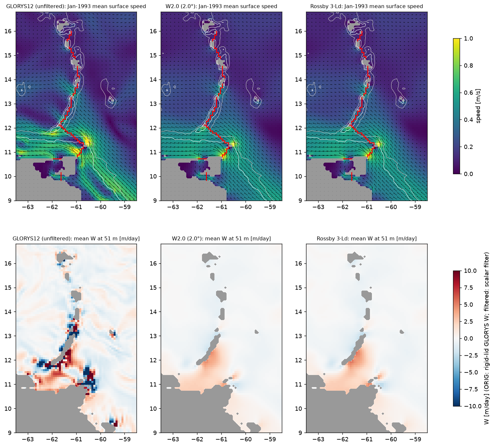
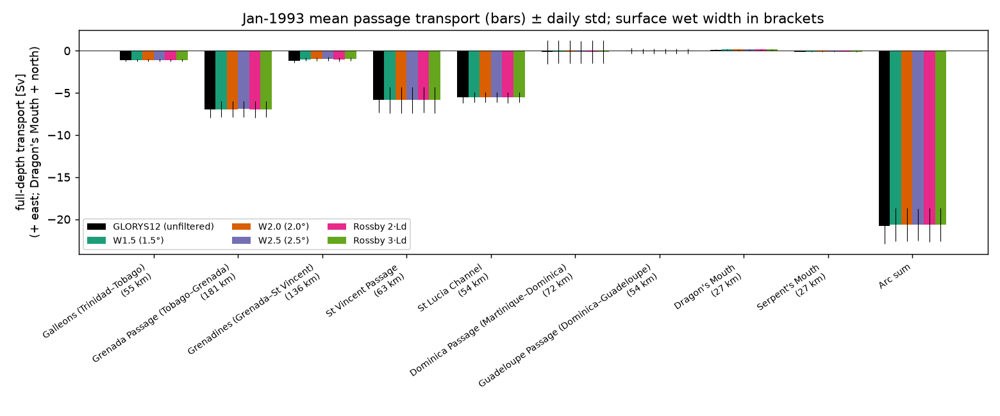

Full-depth mean transport, Sv. Negative is westward into the Caribbean; surface wet width in brackets. The v1 range is over the 5 configs.

| Passage | ORIG | v3 range (5 configs) | v1 range |
|---|---|---|---|
| Grenada Passage (181 km) | −6.94 | −6.93 … −6.95 | −3.90 … −5.86 |
| St Vincent Passage (63 km) | −5.84 | −5.84 … −5.86 | −1.94 … −3.07 |
| St Lucia Channel (54 km) | −5.56 | −5.54 | −1.55 … −3.07 |
| Galleons (Trinidad–Tobago, 55 km) | −1.11 | −1.10 … −1.11 | −0.61 … −0.72 |
| Grenadines (136 km, shallow) | −1.18 | −0.99 … −1.03 (−13…−16 %) | −0.85 |
| Dominica Passage (72 km) | −0.16 | −0.16 … −0.17 | −0.09 … −0.47 |
| Guadeloupe Passage (54 km) | −0.040 | −0.040 … −0.048 | −0.19 … −0.52 |
| **Arc sum** | **−20.82** | **−20.63 … −20.65** | −9.8 … −13.9 |
| Dragon's Mouth (27 km, + north) | +0.123 | +0.142 … +0.154 (+16…+25 %) | +0.05 … +0.06 |
| Serpent's Mouth (27 km) | −0.119 | −0.103 … −0.105 (−12…−13 %) | −0.08 … −0.10 |

- **Transport is conserved in v3.** The passage jets are smoothed, but transport between islands is kept to < 1 % in the deep passages.
  - Why: the div–rot operator filters divergence and interior vorticity. The flow through a gap between two land masses is carried by the island circulation (a harmonic, divergence- and vorticity-free component). With free slip that component lies in the operator's null space, so filtering leaves it unchanged.
  - The remaining changes are in shallow passages and 1–3-cell mouths (Grenadines, Dragon's Mouth, Serpent's Mouth, ±12–25 %), where single-face pockets exist at some levels (section 1).
- **Gulf of Paria.** Mean surface speed rises by +19 % (R2Ld) to +44 % (W2.5) (v1 +2…+54 %). Momentum from the strong flow outside enters through the mouths: the same coastal speed-up as in section 3.
- **Unresolved islands.** Fernando de Noronha and St Peter & St Paul are not in the mask (no land cell within 3 cells), so the filter smooths across them.

#### 9. Domain edges (task 5)

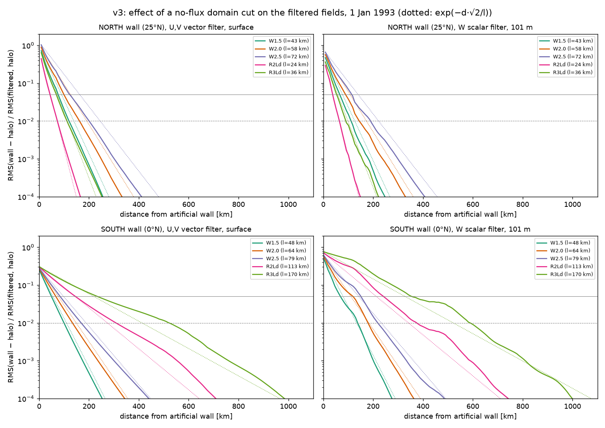

- **U,V wall error.** An artificial wall changes filtered U,V in the first row by 45–103 % of the RMS of the filtered field (v1 38–45 %). The larger wall error comes from the V (U) points of the last row (column): the vector operator treats them as unknowns with outward flux.
- **Decay.** The error decays as exp(−d/λ), λ = ℓ/√2, as in v1. The distance to 1 % is unchanged, e.g. north wall 76 km (R2Ld) to 203 km (W2.5).
- **W.** Scalar filter at 101 m: first-row error 0.29–0.66 (north) and 0.53–0.76 (south). 1 % is reached at 67–194 km (north) and 139–592 km (south, where ℓ is large).
- **Margin rule.** Over all v3 tests, d(1 %) = 3.0–4.9 λ and d(5 %) = 1.6–3.1 λ.
  - **Recommended margin: 5 λ ≈ 3.5 ℓ (one ℓ_box) for 1 % error, ≈ 2.2 ℓ for 5 %.**

  | Edge | W1.5 | W2.0 | W2.5 | R2Ld | R3Ld |
  |---|---|---|---|---|---|
  | 30°N, 1 % | 144 km (1.3°) | 192 km (1.7°) | 240 km (2.2°) | 66 km (0.6°) | 99 km (0.9°) |
  | 10°S, 1 % | 164 km | 218 km | 273 km | ≥ 195 km | ≥ 293 km |

  - The analysis domain starts 555 km from the 10°S edge. That is safe for all W configs, and for R configs at the ~1–2 % level.
  - **At 30°N (no halo), exclude 28–30°N for W configs and 29–30°N for R configs.**
- **Empirical north-edge check.** Zonal sum over 60–40°W, surface EKE retained:
  - W2.0: 0.35 / 0.48 / 0.63 at 20–25 / 25–29 / 29–30°N
  - R2Ld: 0.53 / 0.68 / 0.77

  The uptick in the last degree is larger than in v1 (+0.15 vs +0.07 for W2.0), consistent with the larger wall error of the vector operator. At 454 m it is +0.12 (v1 +0.04).

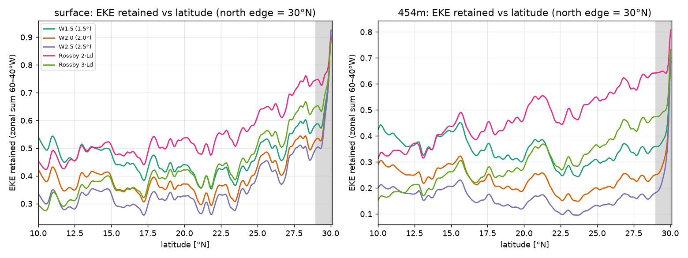

**Continuity residual near the edges** (surface layer, points > 300 km from coast; threshold relative to the ORIG surface hdiv RMS of 2.3·10⁻⁶ s⁻¹):

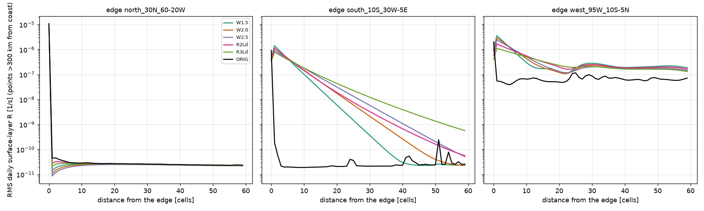

- **ORIG.** The first row itself is 10⁻⁶–10⁻⁵ s⁻¹ in ORIG too: the last row has no outer neighbour. Exclude it always.
- **30°N, filtered.** Updated after W was refiltered with the vector filter's T-cell operator. Beyond the first row, which is the ORIG artefact, R equals the ORIG interior level: 2.3×10⁻¹¹ s⁻¹ for W1.5/W2.0 against ORIG 2.4×10⁻¹¹. **The 30°N edge adds no continuity residual.**
- **10°S (W configs).** R > 1 % of hdiv within 16–19 cells (145–175 km) and > 0.1 % within 24–30 cells (220–275 km). The interior level is (2–4)×10⁻¹¹. This edge is 555 km south of the analysis domain.
- **95°W (Pacific).** R stays at ~2×10⁻⁷ over 550 km (ORIG 6×10⁻⁸). Here the regional cut crosses the Central-American coast and shelf, far outside the analysis domain.
- **Margin.** For continuity, only the western and southern cuts matter, and both lie outside 70–30°W, 5°S–30°N. For the velocity edge error (above), keep ≈ 3.5 ℓ from 30°N.

#### Problems remaining in v3, with locations
1. **Coastal speed-up.** Monthly-mean speed rises by 12–29 % within ~45 km of all coasts, unchanged vs v1. Examples: inner Guiana/Amapá shelf (52–50°W, 3–7°N); Gulf of Paria (+19…+44 %).
2. **Coast-normal flow at the first wet faces** is still +18…+36 % RMS (v1 +44…+71 %). There is zero flux through land faces.
3. **Shelf depth-mean flow KE** rises by 22–29 % (NBC momentum moved across the shelf break), and the ~1000 m slope current at 50–48°W, 3–6°N is damped more than the deep ocean (W2.0 0.62 vs 0.74; R2Ld 0.38 vs 0.54).
4. **Small inlets and 1–3-cell mouths.**
   - Single-face U/V pockets are damped almost to zero (Serpent's Mouth 62°W 10°N at 16 m: −0.41 → −0.01 m/s).
   - Transport changes: Dragon's Mouth +16…+25 %, Serpent's Mouth −12 %, shallow Grenadines −13…−16 %.
   - One overshoot at Cozumel, 86.9°W 20.7°N at 78 m (outside the analysis domain).
5. **Domain edges.**
   - The U,V wall error at the first row is larger than in v1 (up to ~100 %). Keep ≈ 3.5 ℓ from the edges: 1.3–2.2° at 30°N for W configs, 0.6–0.9° for R configs. The EKE uptick over the last degree at 30°N is +0.09…+0.16.
   - The last column (9.9°E) and the last row are unusable.
6. **Fixed in v3:** Lesser Antilles and Guadeloupe/Dominica passage transports, and the v1 one-cell convergence line along walls.
7. **W:** no boundary artefacts found. The final W is filtered with the vector filter's T-cell operator, and the W maps and statistics here were regenerated for it.

## 6. Comparison of the five configurations

Sources: `analysis/nbc_energy/metrics.json`, `analysis/spectra_divergence/metrics.json`, `analysis/boundaries/metrics.json`.

**Definitions**
- Region: 70°W–30°W, 5°S–30°N.
- KE / EKE removed: 1 − filtered/original, volume-weighted. EKE is the KE of daily anomalies from the 31-day mean.
- NBC core: robust 3-point core of the 31-day mean section.
- NBC transport: 0–1000 m, westward at 44°W, northward at 5°N.
- R: RMS continuity residual ∂w̄/∂z + ∇h·ū. "Open" = >40 cells from grid edges and >30 cells from land and bottom steps; "coast" = ≤3 cells from land.
- For reference, the filtered RMS divergence at 110 m is 2.2–4.1×10⁻⁷ s⁻¹.

| | W1.5 | W2.0 | W2.5 | R2Ld | R3Ld |
|---|---|---|---|---|---|
| ℓ at 0° / 15°N / 30°N [km] | 48 / 46 / 41 | 64 / 61 / 55 | 79 / 77 / 69 | 136 / 41 / 19 | 203 / 62 / 28 |
| Total KE removed, 0–1000 m / full depth | 0.38 / 0.42 | 0.49 / 0.53 | 0.57 / 0.61 | 0.53 / 0.55 | 0.68 / 0.69 |
| EKE removed, 0–1000 m / full depth | 0.53 / 0.54 | 0.64 / 0.66 | 0.73 / 0.73 | 0.66 / 0.67 | 0.81 / 0.81 |
| Mean-flow KE removed, 0–1000 m | 0.32 | 0.43 | 0.51 | 0.48 | 0.63 |
| NBC core speed change, 44°W / 5°N | −19 % / −12 % | −23 % / −15 % | −28 % / −18 % | −34 % / −21 % | −40 % / −29 % |
| NBC transport change, 44°W / 5°N | −11 % / −11 % | −16 % / −15 % | −21 % / −19 % | −37 % / −25 % | −49 % / −35 % |
| Net transport change across the whole 44°W section | −3 % | −4 % | −5 % | −4 % | −7 % |
| Retroflection mean-pattern correlation (surface / 92 m) | 0.993 / 0.984 | 0.988 / 0.975 | 0.981 / 0.966 | 0.975 / 0.957 | 0.945 / 0.926 |
| >10° circulation, rel. RMS difference (surface / 92 m) | 1.0 % / 3.5 % | 1.5 % / 5.7 % | 2.2 % / 8.2 % | 3.8 % / 15 % | 7.0 % / 23 % |
| NBC-ring KE retained (3 cases) | 0.76–0.80 | 0.66–0.70 | 0.57–0.62 | 0.58–0.70 | 0.41–0.56 |
| Open-ocean RMS R at 110 m [s⁻¹] (rigid-lid original: 3.2e-11) | 2.9e-11 | 3.7e-11 | 9.1e-11 | 4.4e-10 | 1.5e-9 |
| Coast RMS R at 110 m [s⁻¹] (original: 9.5e-10) | 9.1e-7 | 8.1e-7 | 7.2e-7 | 9.0e-7 | 7.9e-7 |
| Mean surface speed within 45 km of coast (max ratio to original) | 1.13 | 1.18 | 1.22 | 1.24 | 1.29 |
| Lesser Antilles arc transport (original −20.8 Sv) | −20.6 | −20.6 | −20.6 | −20.6 | −20.6 |
| RMS W at 100 / 500 / 1000 m, ratio to original | 0.38 / 0.38 / 0.46 | 0.33 / 0.32 / 0.39 | 0.28 / 0.27 / 0.34 | 0.28 / 0.28 / 0.36 | 0.21 / 0.21 / 0.28 |
| Wall-clock on one A100 (U,V run + W run) | 21 + 13 min | 22 + 13 min | 24 + 13 min | 30 + 14 min | 39 + 16 min |

**Qualitative assessment**
- **W1.5: mild.** Half of the eddy variability remains, and rings keep ~80 % of their KE. The mean currents are essentially intact. It suits studies needing a light de-noising more than a mesoscale separation.
- **W2.0: balanced.** Two thirds of EKE is removed, and sub-100 km eddies and filaments are gone. The NBC keeps 84–85 % of its transport and the retroflection/NECC pattern is unchanged (r = 0.99). Rings are weakened but not removed.
- **W2.5: strong.** Nearly three quarters of EKE is removed and the mesoscale north of 15°N is largely gone. The narrow NBC loses ~20 % of its transport and 28 % of its core speed.
- **R2Ld: scale-aware but mismatched to this region.**
  - Box energetics are similar to W2.5, but the NBC loses 37 % of its westward transport, because ℓ ≈ 136 km at the equator.
  - North of 15°N it keeps the eddy field (ℓ < 40 km), i.e. the opposite of a mesoscale-removal filter there.
  - Its residual is 10× the window configs in open ocean, from the rapidly varying ℓ, though still < 1 % of the divergence.
- **R3Ld: too aggressive at the equator.** It halves NBC transport and ring KE and degrades the large-scale 92 m circulation by 23 %. It is not a clean mean/eddy separation.

**Common to all configurations**
- There is no flow through land.
- Passage transports through the Lesser Antilles are conserved to < 1 %.
- The coastal band of ~45 km speeds up by 13–29 %, and the depth-mean shelf KE rises by 22–29 %, because a free-slip horizontal smoother spreads slope-jet momentum onto the shelf.
- W keeps only 1–6 % of its daily variance near coasts, where the original W is grid-scale noise. There are no coastal artefacts in W.

## 7. Recommendation for the full-dataset processing
**Use W2.0**: ℓ = 2°·(π/180)·R·cos φ / 3.5, box-equivalent 222 km at the equator. The window configurations are equally cheap, so the choice is about physics.
1. **Mesoscale removal vs mean-flow preservation.** W2.0 is where the trade-off turns. From W1.5 to W2.0, EKE removal rises by 11 points (0.53 → 0.64) for a 5-point transport loss (−11 → −16 %). From W2.0 to W2.5 it rises by 9 points for another 5-point loss, and the >10° circulation difference at 92 m grows from 5.7 % to 8.2 %.
2. **Lagrangian tracking.**
   - The NBC–retroflection–NECC pathway, which carries Amazon water, is kept: r = 0.99, net section transport −4 %.
   - Filaments and sub-100 km eddies, which dominate dispersion noise, are removed.
   - Filtered U, V, W are mutually consistent in the open ocean to the level of the original data.
3. **A uniform, latitude-aware scale** (the grid spacing ∝ cos φ) avoids the Rossby filters' problem in this domain. Those filter hardest at the equator, where the NBC is, and least in the subtropics, where the eddies are.

**Caveats and practical rules for tracking**
- **No filter here removes NBC rings without damaging the NBC.** Rings (300–450 km diameter) have wavelengths comparable to the NBC's cross-shore scale, and the Lorentzian response G = 1/(1 + ½ℓ²K²) of the n = 1 implicit filter is gentle. If ring removal is essential, test the n = 2 filter (steeper response, not tested here), or a larger window combined with an explicit NBC-preserving treatment.
- **Seasonal cycle.** Only January 1993 was processed, so monsoon-driven NBC intensification and NECC formation could not be evaluated. The >10° circulation is preserved to 1–6 %, which suggests the seasonal signal will survive W2.0. Verify with a few months spanning boreal spring and autumn before the full run.
- **Domain edges.**
  - Keep particles ≥ 3.5ℓ (≈ 1.7° for W2.0) away from the 30°N cut, where filtered velocities are affected by the artificial wall.
  - Ignore the last row and column of the grid.
  - Near the 95°W and 10°S cuts, U,V/W consistency degrades within ~450 km; both are far outside the analysis domain. A larger halo in the next extraction removes this issue.
- **Coasts and shelf.**
  - Expect 13–29 % higher mean speeds within ~45 km of the coast, with more cross-shelf-break momentum.
  - Continuity residuals of ~10⁻⁶ s⁻¹ appear at bottom steps next to slopes, which is inherent to level-by-level horizontal filtering.
  - For beaching and shelf retention studies, compare against unfiltered runs.
- **W convention.** The filtered W is the rigid-lid product: zero at the surface, as in the existing Parcels setup. It does not contain ∂η/∂t.

## 8. Code and reproduction
See `implicit_run/README.md` for the layout and exact commands. In brief:
- **`cgrid_filter.py`:** filter library (operators, GPU solver, continuity).
- **`run_filter.py` / `run_filter.sh`:** production, one configuration per GPU job.
- **Validation:**
  - `tests/validate_filter.py`: synthetic transfer function; cross-check with the `implicit_filter` package solver (2×10⁻⁸); symmetry and conservation.
  - `tests/validate_vector.py`: vector-filter commutation with divergence (5×10⁻⁵).
  - `tests/test_e3_independence.py`: response independent of e3 for rotational and divergent waves.
- **Analysis:** `analysis/{nbc_energy,spectra_divergence,boundaries}/`, each with scripts, `metrics.json` and figures.
- **Rossby radius:** `rossby/rossby_radius.py`.
- **Notebook:** `implicit_data/v0.Implicit_filtering_ARP.ipynb`, the interactive version of every step. It was executed end-to-end on an A100 with papermill; the executed copy is `implicit_run/scratch/nb_executed.ipynb`.
